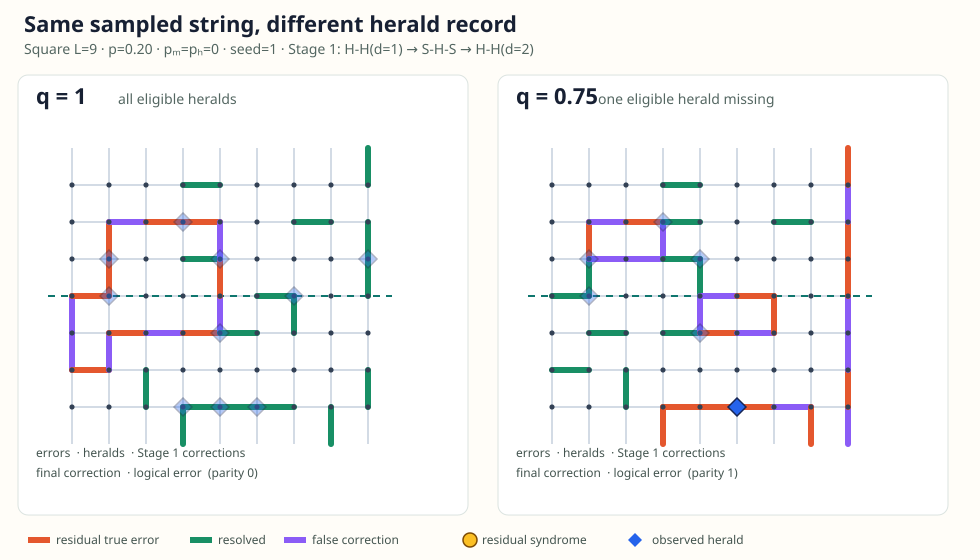

# Lab 001 — String-herald decoder workbench

## Overview

### L001.1 Motivation

Make the two-stage string-herald decoding convention inspectable before using it as a downstream baseline.

### L001.2 Background

The workbench displays physical errors, herald decisions, syndrome matching, residual strings, and logical parity on square and honeycomb instances.

### L001.3 Question

Do the visualizations faithfully expose each stage of the hard-herald, syndrome-only matching pipeline?

### L001.4 Hypothesis

An explicit configuration-level display makes boundary conventions and failure modes reproducible.

## Evidence

### L001.5 Validated interface

The frozen workbench provides a tested configuration-level baseline, documented by the [two-stage workbench](wiki/overview.md).

*Figure L001.5 — a configuration-level herald ablation makes the two-stage display convention inspectable; data: [two-stage workbench evidence](wiki/overview.md).* 

| Established | Boundary |
| --- | --- |
| Reproducible stage display | Not an ensemble LER or threshold study |

## Analysis

### L001.6 Implications

Later Labs can reuse the boundary conventions and hard-decision baseline without treating this visualization as decoder performance evidence; see the [two-stage workbench boundary](wiki/overview.md).

### L001.7 Limitations

No statistical logical-error-rate or threshold claim is made; this limitation is part of the [two-stage workbench boundary](wiki/overview.md).

### L001.8 Next question

Downstream belief-aware comparisons belong in Lab 002.
