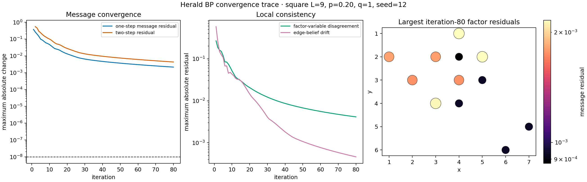
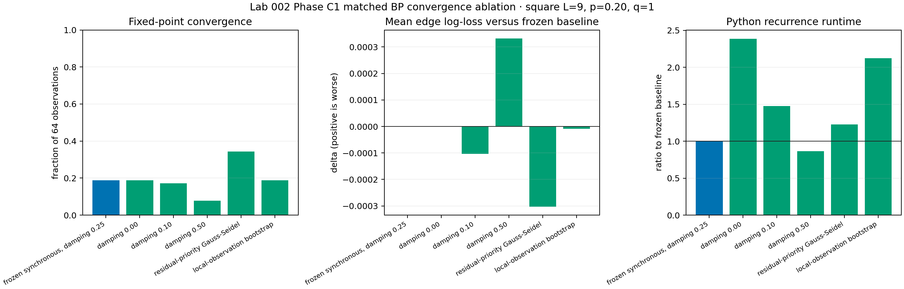
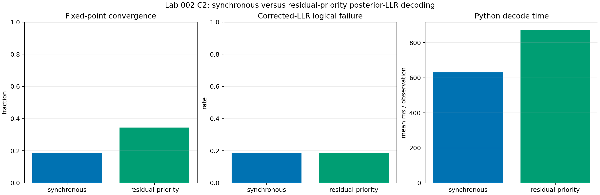
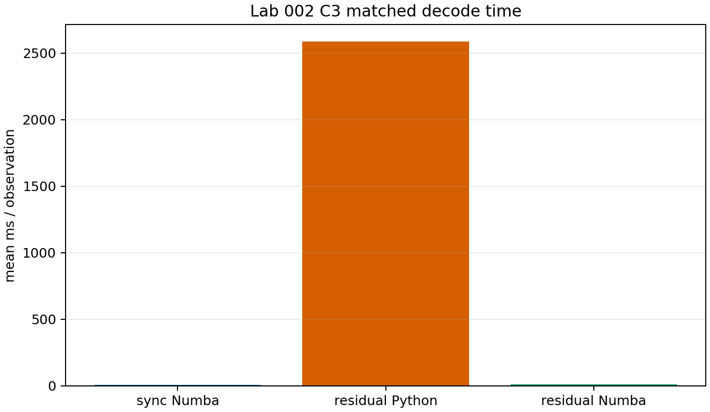
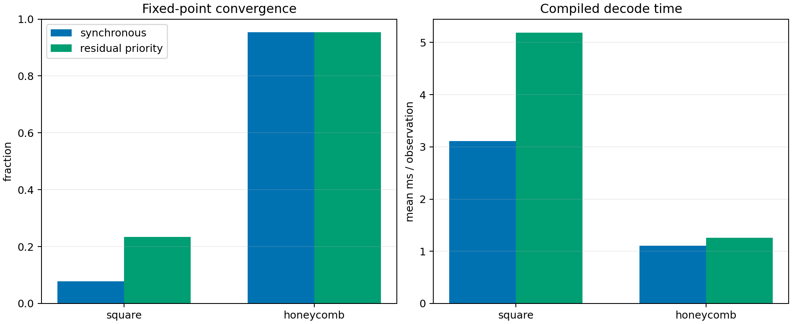
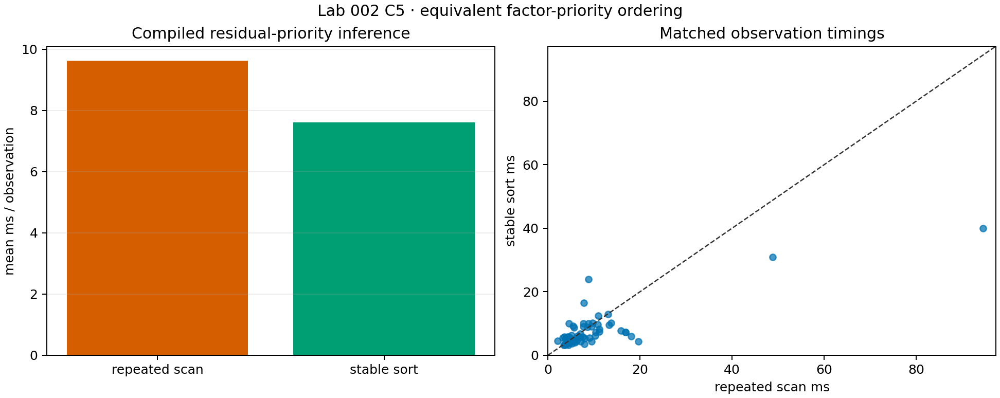
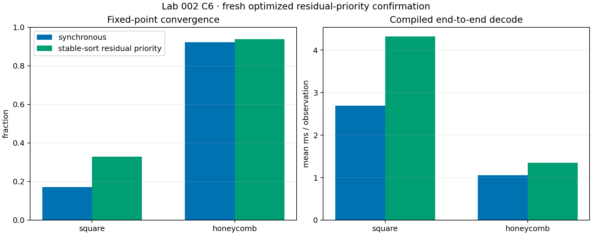
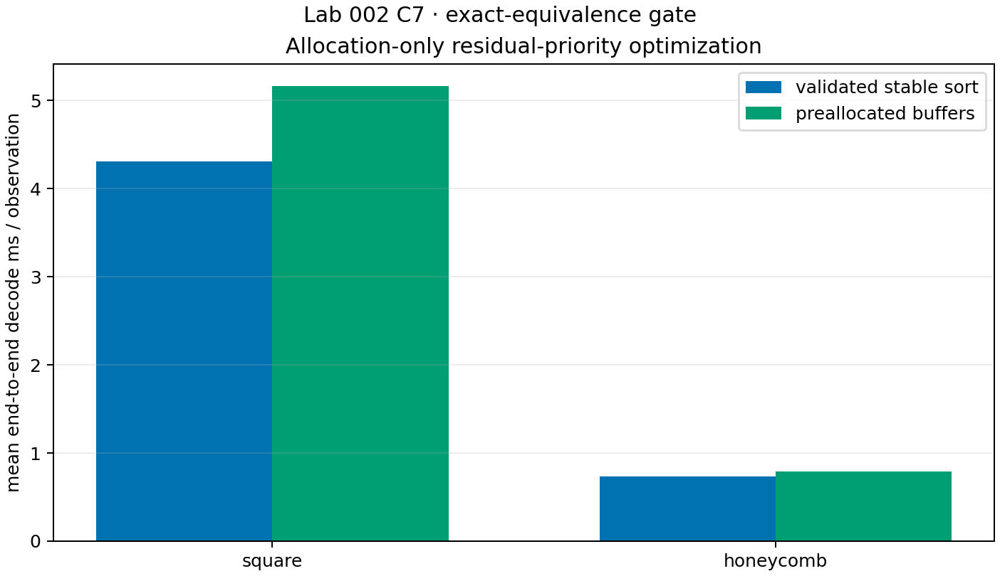
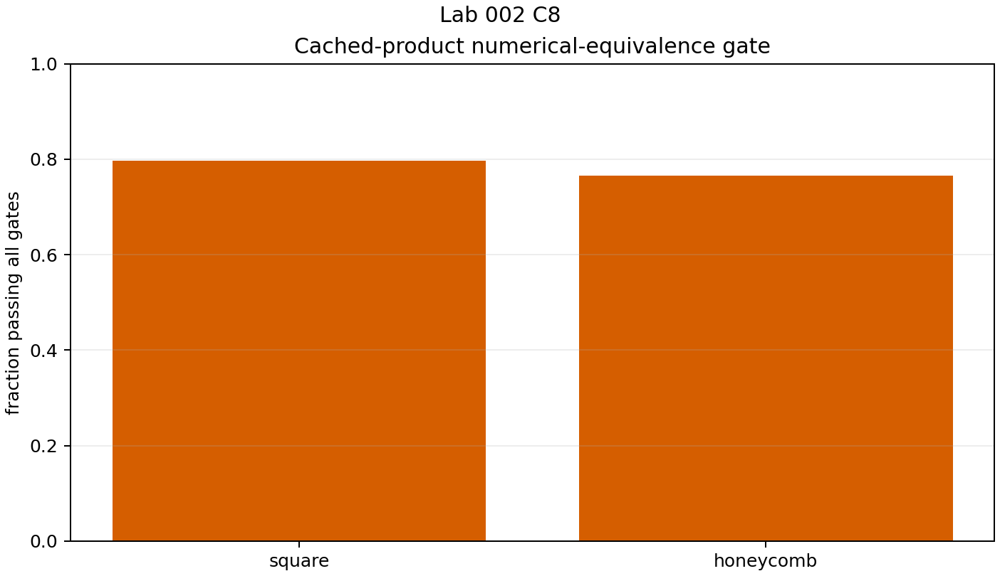

# BP convergence remediation, C0--C8

This mechanism track investigates fixed-point convergence, not a threshold or
an LER claim.

## C0--C1: diagnosis and intervention screen

C0 shows slow residual drift rather than a period-two orbit: the maximum
residual falls from 1.32e-2 at iteration 20 to 2.16e-3 at iteration 80, still
above the 1e-8 tolerance.

C1 tests damping, initialization, and residual-priority scheduling on 64
matched square samples. Synchronous damping-0.25 converges on 12/64; residual
priority converges on 22/64 (+15.6 points), while damping changes and local
initialization do not improve it.

## C2--C4: correction interface and replication

C2 confirms syndrome-faithful posterior-LLR corrections but finds the Python
schedule slow (+243.6 ms per observation after timing controls). C3 compiles
the exact schedule; C4 independently replicates the convergence gain and
end-to-end cost.

## C5--C8: bounded implementation work

C5 is an exact stable-sort replacement for repeated priority scanning.

C6 is the common-protocol endpoint comparison: square convergence is 21/64
versus 11/64, but residual priority is 1.63 ms slower. Honeycomb is 60/64
versus 59/64 and 0.29 ms slower. The finite sample has no paired logical
rescue or harm.

C7 buffer reuse preserves exact output but is slower.

C8 cached products change posterior/correction-relevant output and fail the
equivalence gate before timing: 13/64 square and 15/64 honeycomb observations
fail, including one correction and three iteration disagreements.

## Conclusion

Residual-priority scheduling is the strongest tested convergence mechanism,
but not the default: its validated implementation remains slower. Stable sort,
buffer reuse, and cached products do not change that decision. Detailed JSON
evidence runs from [`../results/convergence-trace-seed12.json`](../results/convergence-trace-seed12.json) through [`../results/residual-priority-c8.json`](../results/residual-priority-c8.json).
