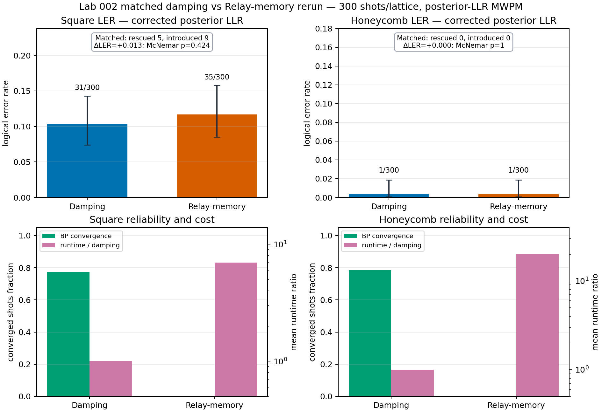
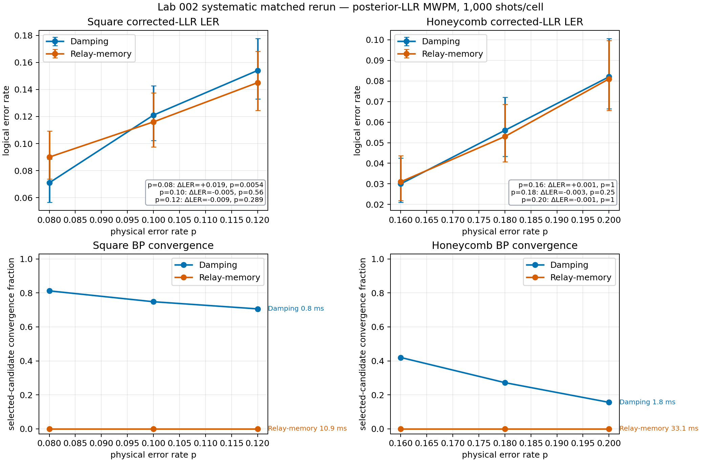

# Decoder interface and Relay-memory selection

## Question

Does Relay-memory BP improve probability-damped BP when both use the same
correct posterior-to-matching interface?

## Interface correction

The old `-log P(error)` projection is not independent-posterior MAP decoding.
The executable path uses clipped posterior LLR, \(\log((1-r)/r)\). Historical
logical claims with the old rule are invalidated.

## Corrected matched evidence

The first corrected L=5, p=0.10, q=0.75 rerun is an implementation check:
Relay-memory has no convergence and is slower, while its LER sample is too
small to establish a benefit.

The six-cell rerun is the backend-selection evidence: five seeds x 200
matched shots per cell, with separate square and honeycomb p grids.
Relay-memory regresses at square p=0.08, has no resolved benefit elsewhere,
worsens proper scores in every cell, has no selected converged candidate, and
is slower.

Evidence: [`../results/llr-memory-vs-damping-rerun-2026-08-27.json`](../results/llr-memory-vs-damping-rerun-2026-08-27.json), [`../results/llr-systematic-memory-vs-damping-rerun-2026-08-27.json`](../results/llr-systematic-memory-vs-damping-rerun-2026-08-27.json), and [`../results/negative-log-invalidation.md`](../results/negative-log-invalidation.md).

## Conclusion

Probability-damped BP is the retained backend. Relay-memory remains an
explicit experimental recurrence; this is neither a threshold nor a
herald-benefit result.
