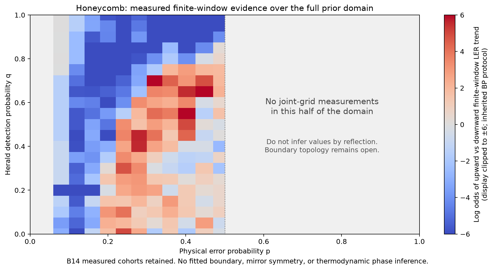

# Lab 003 — Herald decoding evidence and corrected domain

## Scientific correction

The physical binary-herald domain is **p,q in [0,1]**. For 0<q<1 there is no general p↔1−p symmetry of the visible record or optimal logical risk. B18's symmetry-constrained guide and its horizontal tangent at p=0.5 are withdrawn. The uniform-prior point remains special, but is not a domain boundary. See [model and counterexample](/wiki?page=methods/binary-herald-full-prior-domain.md).

## Current evidence

*The inherited B14 trial counts and finite-window BP trend values are retained. Gray regions have no joint-grid measurements. No values are mirrored and no transition curve is imposed. This is evidence coverage, not a completed thermodynamic phase diagram.*

*Historical fixed-q cohorts retain their own size, geometry and decoder labels; they do not fill the unmeasured joint grid.*

## Interpretation and follow-on

Measured low-p finite-size behavior remains usable within its sampled protocol. Claims of an all-p herald ceiling based only on the half-domain scan are withdrawn. High-p recovery and transition topology need independent analysis; the boundary need not be a single-valued p_c(q). Approximate decoder behavior and optimal recoverability must be distinguished.

[Lab 009](/lab?id=lab-009-planar-herald-decoder-survey) now studies the full domain with endpoint checks, exact sector inference and independent high-p matched diagnostics. A converged full-domain phase diagram remains open. Historical B18 artifacts are retained only as withdrawn provenance.
