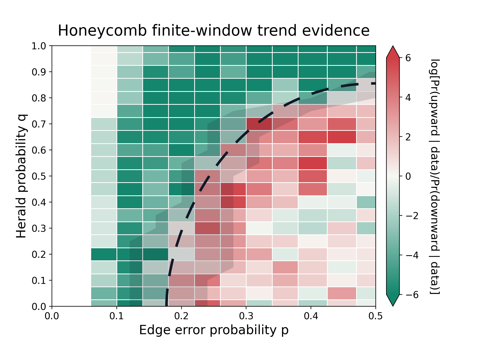

# Lab 003 — Herald decoding phase diagram

## Overview

### L003.1 Motivation

Characterize finite-size directional evidence across heralding parameters without overstating it as an asymptotic phase boundary.

### L003.2 Background

The study pools fixed-window logical-error-rate curves and trend diagnostics over the registered grid.

### L003.3 Question

Which regions show robust finite-window directional behavior under the measured protocol?

### L003.4 Hypothesis

Finite-size evidence can identify conservative directional regions while retaining uncertainty near crossings.

## Evidence

### L003.5 Finite-window map

The current honeycomb evidence is a finite-window directional map, not a threshold estimate; its boundary is maintained in [finite-window trend evidence](wiki/overview.md).

*Figure L003.5 — the map summarizes the registered finite-window directional evidence, not an asymptotic threshold; data: [finite-window trend evidence](wiki/overview.md).* 

| Established | Boundary |
| --- | --- |
| Conservative directional regions on the registered grid | No asymptotic threshold or sharp phase boundary |

## Analysis

### L003.6 Implications

The map guides where adaptive sampling would be informative, but it does not justify extrapolation beyond its sampled sizes and grid; see [finite-window trend evidence](wiki/overview.md).

### L003.7 Limitations

Unresolved crossings and finite-size effects remain explicit in [finite-window trend evidence](wiki/overview.md).

### L003.8 Next question

Any new threshold estimate requires a separately registered adaptive sampling study.
