# Convergence-cap and high-q diagnostics

These figures separate BP fixed-point-cap sensitivity from logical-decoding
claims. They explain why a cap change or a visually plausible crossing is not
automatically a boundary correction.

## N0: square high-p cap diagnostic

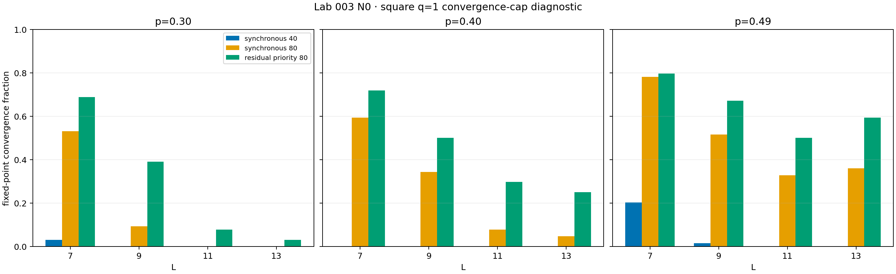

Increasing the cap raises the convergence flag, but the matched 80-iteration
arms have identical logical outcomes. This is a mechanism result, not a new
default or threshold estimate.

## q=1 honeycomb discovery and refinements

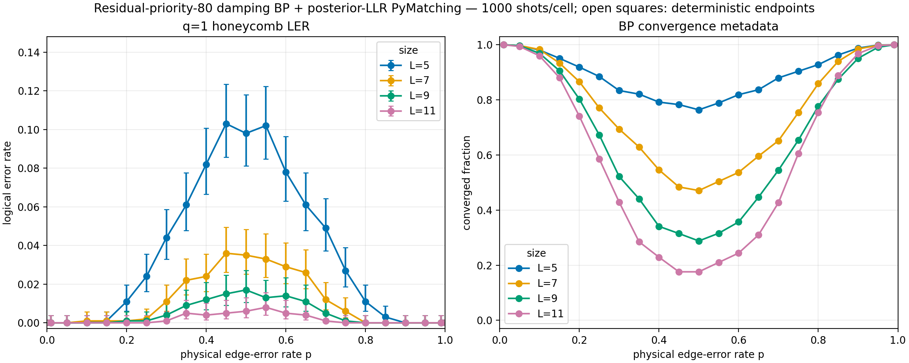

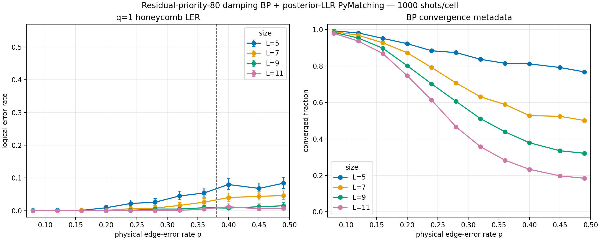

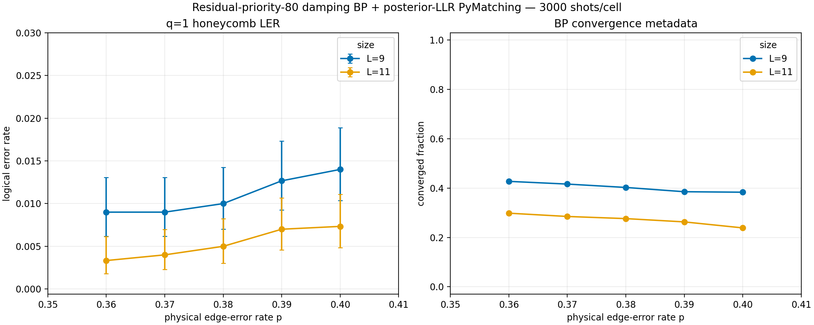

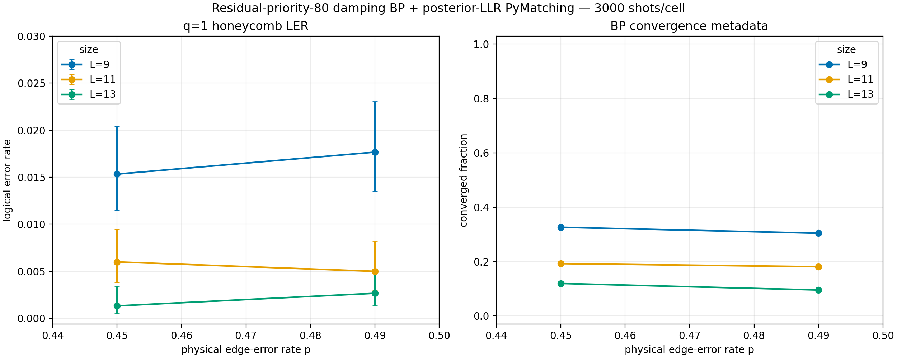

The initial point crossing is not reproduced cleanly, and later high-p size
comparisons remain limited by convergence. No q=1 threshold is promoted.

## Phase 2--4 high-q waves

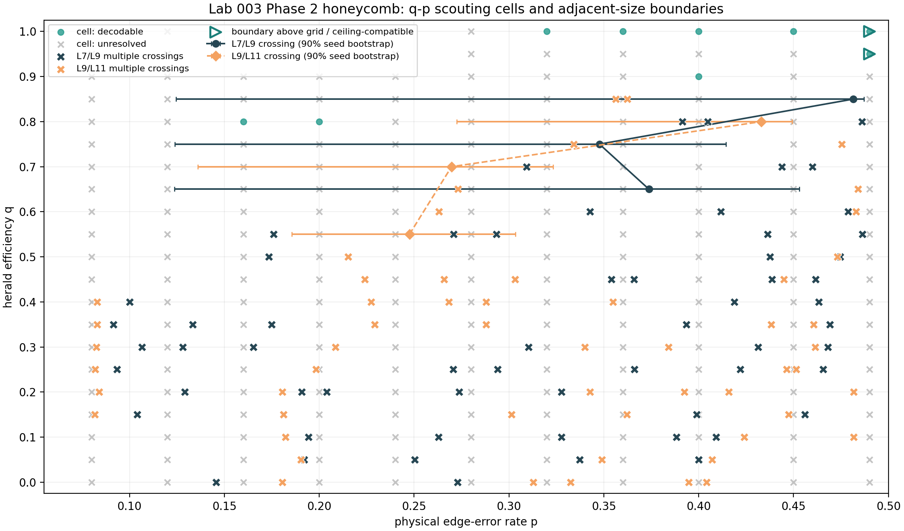

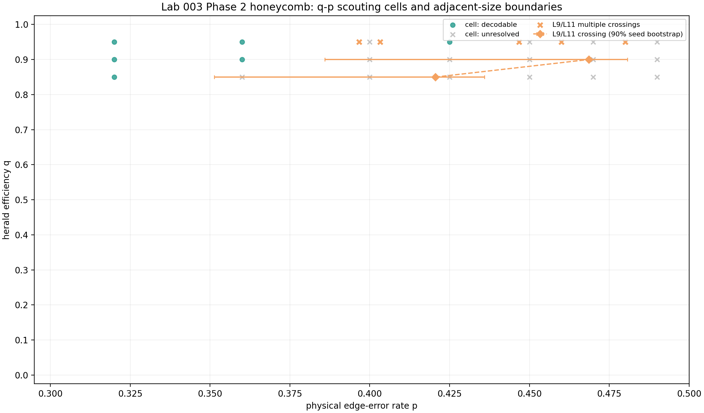

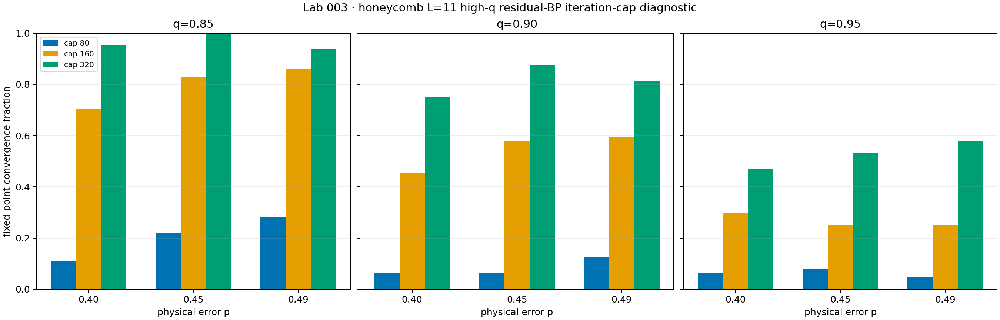

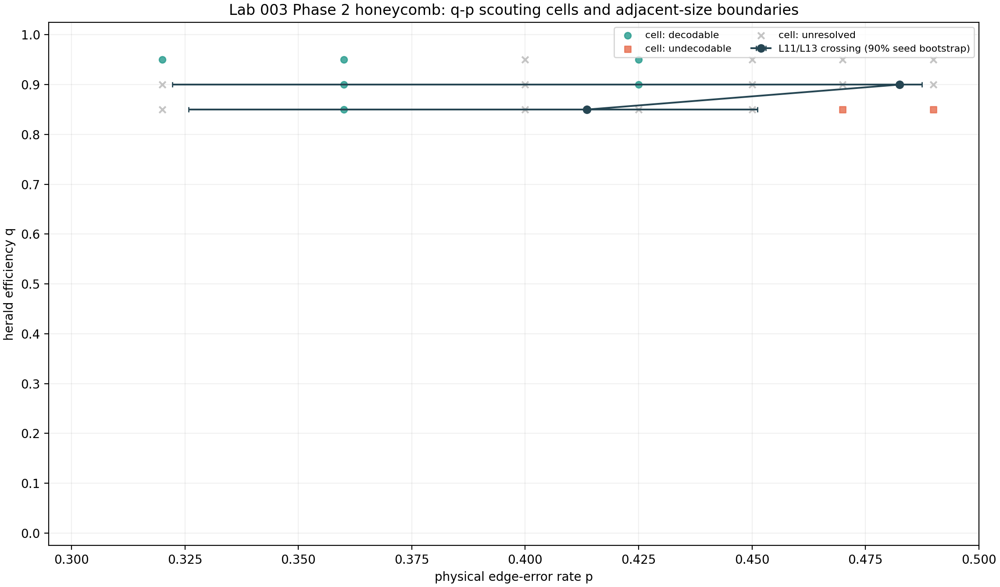

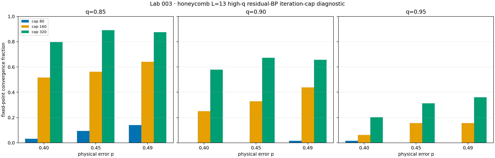

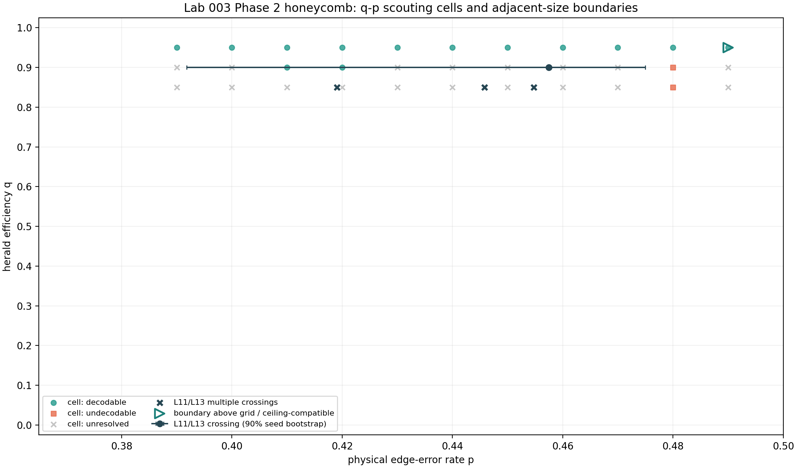

Across these waves, larger caps improve fixed-point flags but do not change
the matched logical outcomes enough to justify changing the primary cap.
High-q topology and cohort instability keep q_c and p_c(q) unpromoted.
