# Fixed-q LER curves and baseline checks

These panels establish the finite-window LER observations that motivate the
later honeycomb-first boundary investigation. Curves use separate geometry and
decoder cohorts; they are not pooled threshold fits.

## Main fixed-q summary

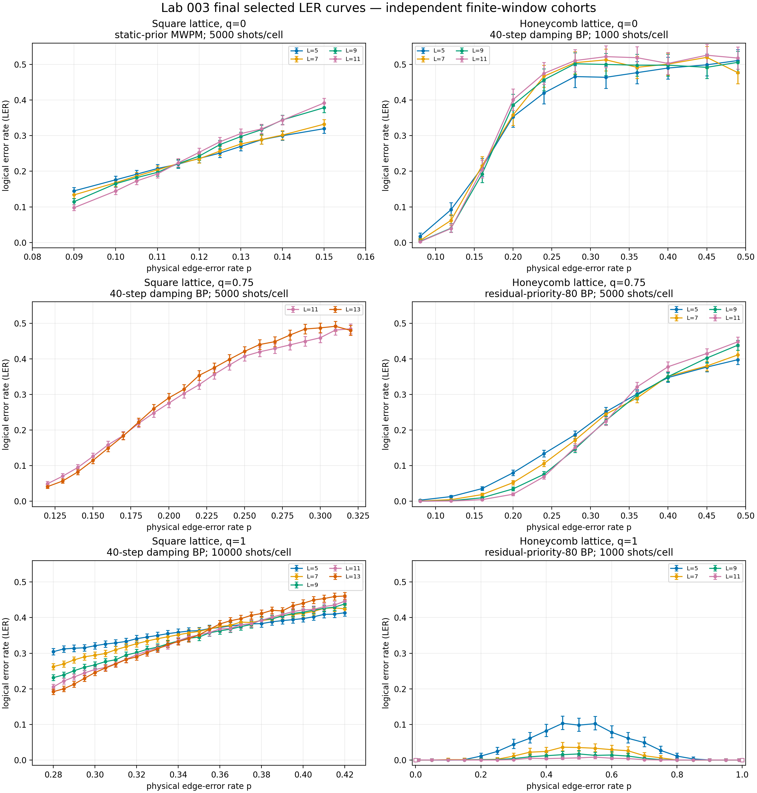

## q=0 calibration and q=0.75 comparison

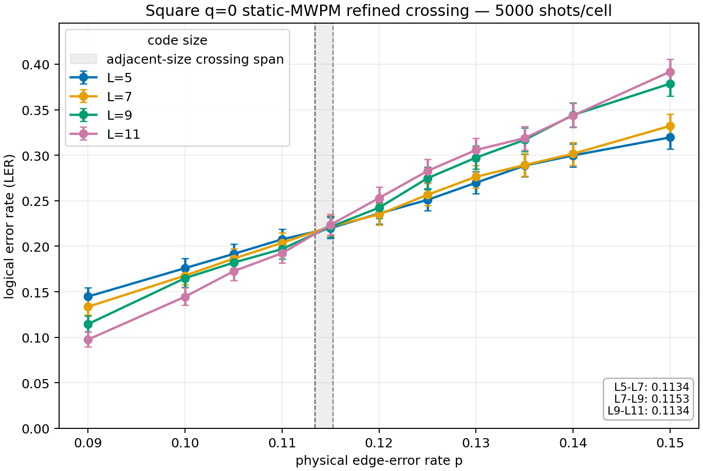

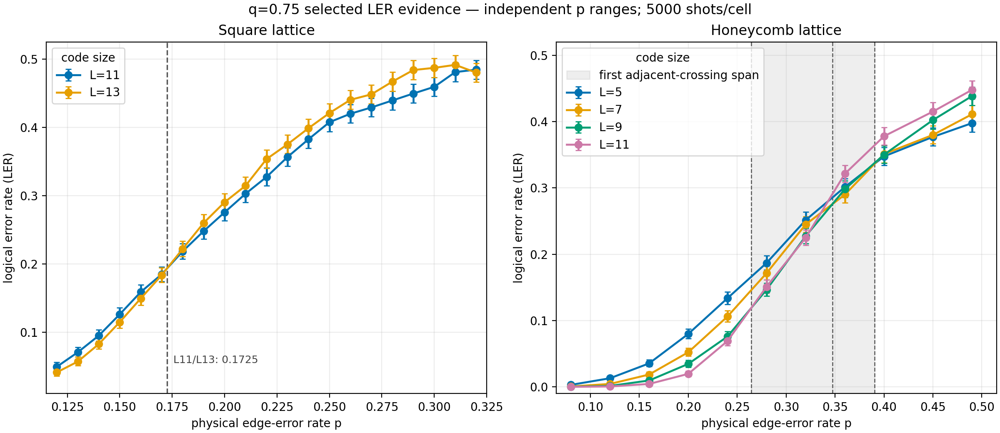

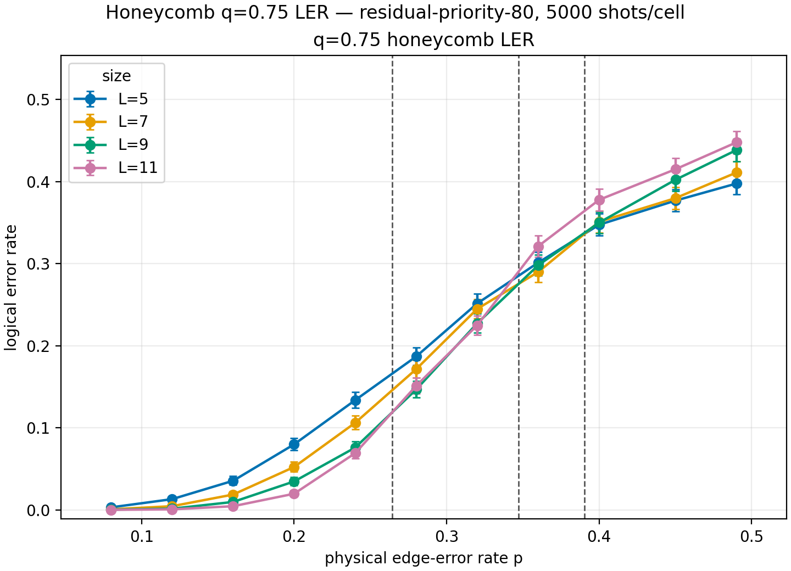

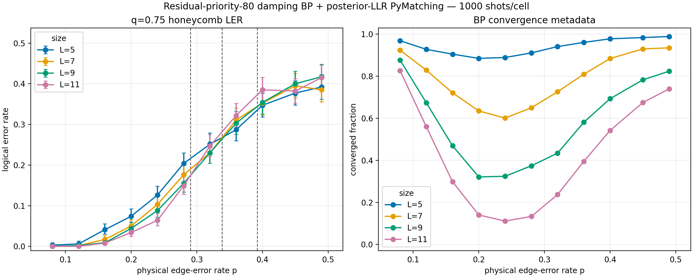

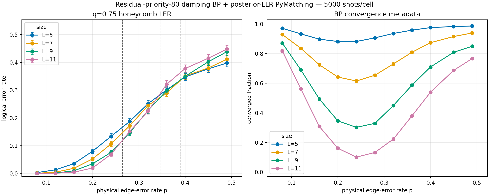

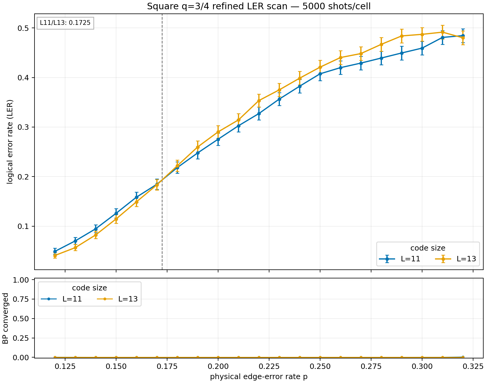

The q=0.75 plots improve precision but retain size drift and convergence
limitations; they do not promote one crossing to a threshold.

## q=1 square refinements

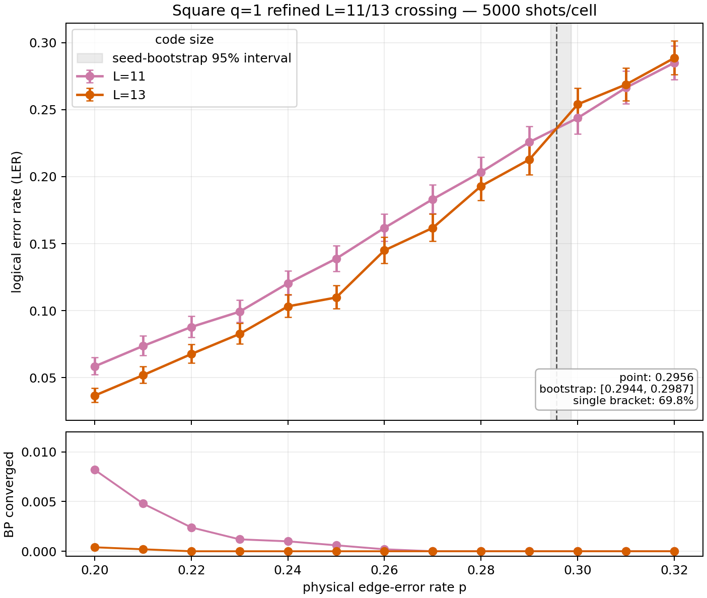

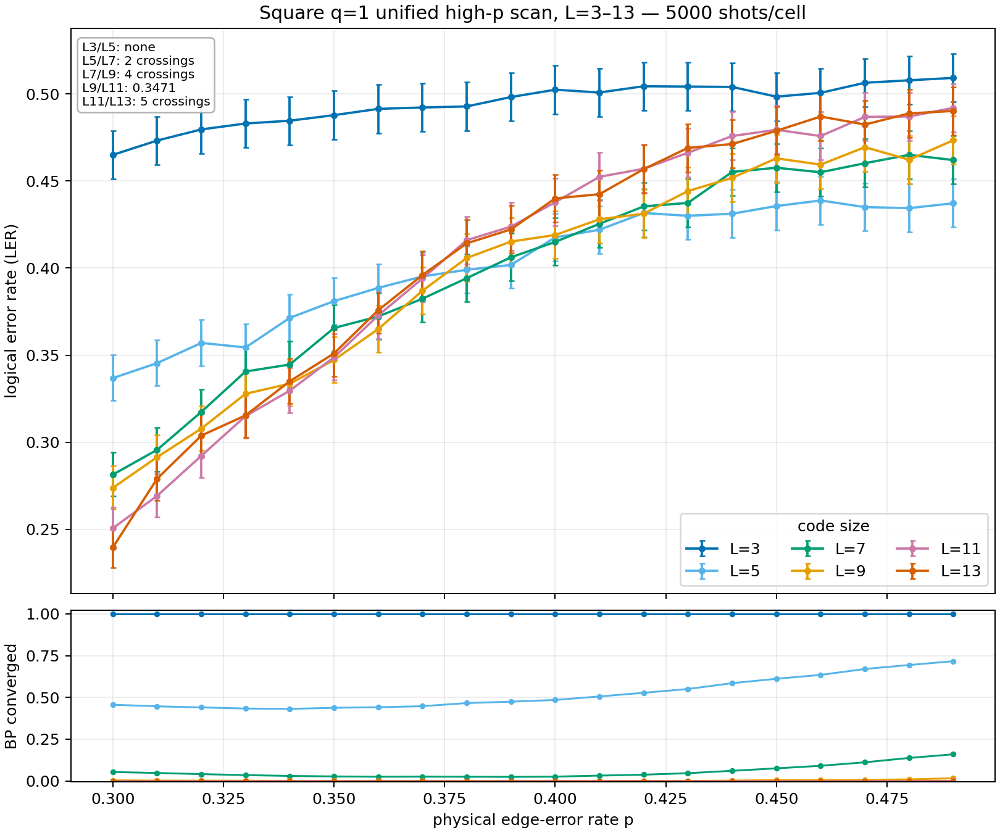

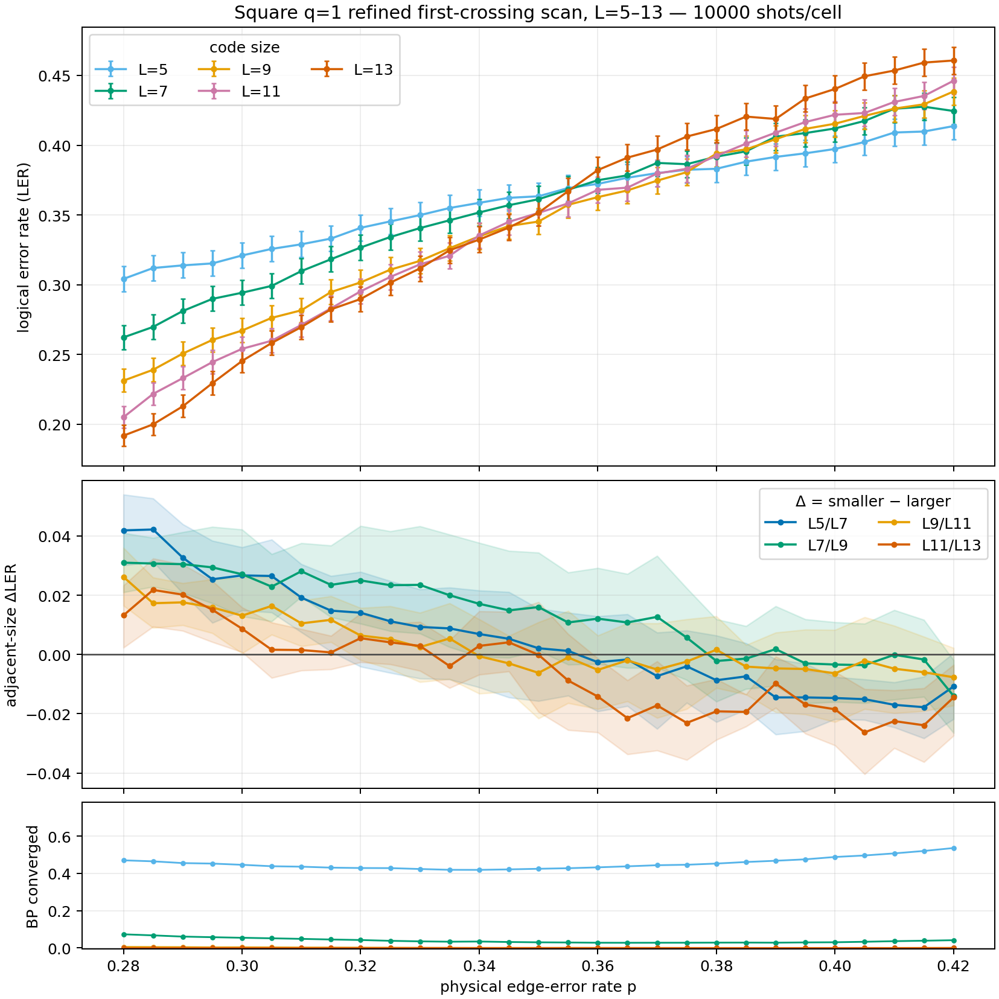

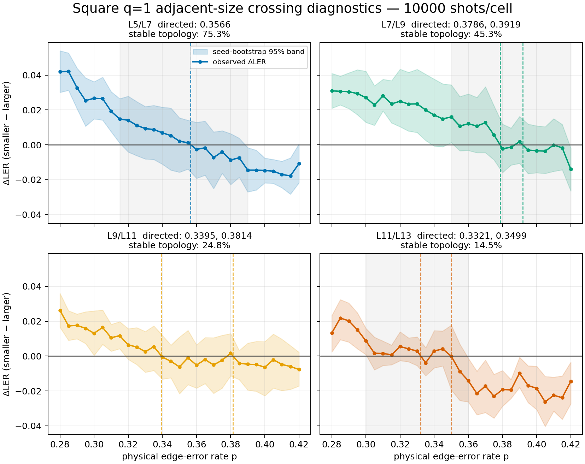

The LER figures are finite-window evidence. Their raw and analysis provenance
is indexed in [`../results/README.md`](../results/README.md).
