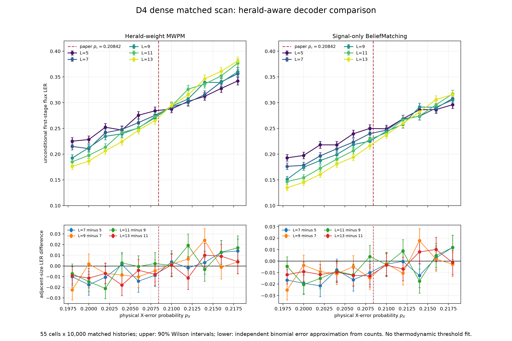

# Lab 004 — Intrinsic-heralded D4 decoding

## Overview

### L004.1 Motivation

Intrinsic heralding can improve decoding only when the decoder receives exactly the public fusion record available in the physical protocol. This lab establishes the model and validation boundary needed before a practical decoder comparison can be trusted.

### L004.2 Background

The D4 model distinguishes physical faults, public fusion signals, and private truth used only for scoring. The record and its likelihood boundary are maintained in the [observation-model Local Wiki page](wiki/observation-model.md).

### L004.3 Question

Under that public record, what is established about exact recovery, matching-based recovery, and belief-assisted matching—and what remains unmeasured?

### L004.4 Hypothesis

Using valid herald information should improve a decoder relative to unit-weight matching, but a performance or threshold claim requires a matched public-input experiment rather than a curve computed with hidden information.

## Evidence

### L004.5 Validated model and reference boundary

The paper-normalized D4 observation model and bounded exact references have been independently audited. They validate the spatial pipeline on its stated finite instances; they do not establish a thermodynamic threshold. See [observation model](wiki/observation-model.md) and [decoder validation](wiki/decoder-validation.md).

### L004.6 Public-information correction

The earlier belief-assisted comparison leaked a hidden fusion distinction into the decoder input. Its curves are withdrawn as performance evidence. The corrected binary signal-only input boundary is documented in [BP signal-model boundary](wiki/bp-signal-boundary.md).

### L004.7 Reader-facing comparison boundary

Threshold figures are shown only where their horizontal range contains the corresponding decoder's decision region. The current herald-aware comparison is presented below; Unit-weight MWPM requires a separate low-$p_X$ figure around its own transition and is not mixed into this panel. The [D4 observation-model boundary](wiki/observation-model.md) owns the comparison scope and evidence limits.

### L004.8 Corrected herald-aware finite-size scan

The original corrected scan contained 100,000 matched trajectories and remains historical evidence. The intermediate three-point compact scan is retained only as an auxiliary count record. The new dense compact scan adds 550,000 matched trajectories across $L=5,7,9,11,13$ and $p_X=0.198,0.200,\ldots,0.218$. It persists only sufficient counts, from which Wilson intervals are reconstructed. The corrected BP decoder sees only the public binary $e_B/e_G$ signal. The new scan still uses a fixed 40-iteration BP cap; every BP history reaches that cap, so it improves sampling precision without establishing BP convergence or a thermodynamic threshold. The [BP signal-model boundary](wiki/bp-signal-boundary.md) maintains the source record and interpretation.

*Figure L004.8 — updated dense matched scan: Herald-weight MWPM and signal-only BeliefMatching over $L=5,7,9,11,13$ and $p_X=0.198,0.200,\ldots,0.218$, with 10,000 histories per cell. The upper panels show 90% Wilson intervals reconstructed from counts; the lower panels show adjacent-size differences with independent binomial error approximations because compact storage does not retain cross-size trajectory pairing. The dashed line marks the paper value $p_c=0.20842$; it is a reference, not a fit from this scan. Unit-weight MWPM is absent because its transition lies near $p_X=0.159$; data: [dense count record](results/r6al-dense-crossing-scan-2026-09-09.json).* 

### L004.9 Cross-lab channel-equivalence audit

The Lab 003 $q=3/4$ phenomenological channel and the corrected signal-only D4
channel are non-equivalent. They differ in local herald law, joint
correlations, open versus periodic geometry, parameter meaning,
decoder-visible record, BP implementation, and logical-loss observable. At
nominal $L=5$, their graphs even contain 74 versus 225 edges. Therefore no Lab
003 LER, crossing, phase-map boundary, or threshold-like value is numerically
comparable to this scan or the paper D4 result. The [observation model](wiki/observation-model.md) owns the audited comparison.

### L004.10 Evidence map

| Claim family | Current evidence boundary |
| --- | --- |
| Public observation record | [Observation model](wiki/observation-model.md) |
| Exact and matching validation | [Decoder validation](wiki/decoder-validation.md) |
| Belief-assisted comparison | [BP signal-model boundary](wiki/bp-signal-boundary.md) |

## Analysis

### L004.11 Implications

The compact 150,000-history scan preserves the validated public-record comparison at higher sampling precision. BP remains lower-risk than O0 and O2 in every sampled cell, while the size-difference signs near $p_X=0.208$ still vary across adjacent pairs; same-cell decoder ordering therefore does not establish a threshold. The [BP signal-model boundary](wiki/bp-signal-boundary.md) owns the underlying audit trail and detailed records.

### L004.12 Limitations

The corrected compact scan supports a signal-only belief-assisted finite-size LER curve with count-derived Wilson intervals, but not a threshold. The compact storage contract omits per-history records, so paired bootstrap intervals across sizes cannot be reconstructed from this artifact alone. Earlier support-revealing BP curves remain provenance only because their input record was invalid, as documented in the [BP signal-model boundary](wiki/bp-signal-boundary.md). Every capped-grid BP run reached the registered 40-iteration cap, so convergence remains a reported sensitivity limitation.

### L004.13 Two-stage public-charge preflight

The source-audited causal join ran only the smallest
discriminating $L=2$ fixture. Its initial fail-closed run localized two public
interface defects; after remediation, the corrected signal-only first record,
matched first history, action-conditioned second support under a shared
exogenous key, own-support checks, zero-error decoding, full-binary second
record, relation-free public charge action, anti-leak transcript, wrong-action
binding, and Boolean-union scorer all pass. No finite-size histories were
allocated. See the [decoder-validation Local Wiki page](wiki/decoder-validation.md).

### L004.14 Next question

On the smallest preregistered paired O0/O2 grid, does the complete two-stage
public decoder reproduce the expected information advantage without changing
the channel, matched-randomness coupling, or unconditional Boolean-union loss?

The registered pilot completed all 512 matched histories in each of four
cells. O0/O2 final risks were 0.4668/0.2363 and 0.5938/0.3320 at $L=3$,
then 0.5586/0.1719 and 0.7031/0.3281 at $L=5$, for
$p_X=0.19,0.21$ respectively. The corresponding O2-minus-O0 differences and
pointwise 90% paired intervals are $-0.2305[-0.2676,-0.1934]$,
$-0.2617[-0.3027,-0.2227]$, $-0.3867[-0.4258,-0.3477]$, and
$-0.3750[-0.4160,-0.3340]$. All four pilot cells therefore resolve an O2
improvement at the registered pointwise level. Most of the difference comes
from fewer first-stage Boolean-union failures; the common public charge stage
was held fixed. All 12 deterministic replays pass. This remains a four-cell
pilot, not a threshold, scaling, or fault-tolerance result.

### L004.15 Public-interface source consistency

The preregistered deterministic extraction passed all six frozen
evidence/status gates and classified every extracted quantity before
interpretation. Its verdict is **qualitatively consistent with a nonuniversal
boundary**. The complete public pipeline agrees with the low/intermediate-prior exact primitive public O2
direction, and both studies independently identify the first action as a
major performance lever. The exact primitive's slight public-fixed O2 regression at
$p=0.6$ is preserved as a counterexample to universal O2 dominance.

Topology, size, conditioning, parameter grids, charge graphs, risk and delta
magnitudes, stage counts, and exact-versus-Monte-Carlo uncertainty remain
incommensurate. No histories, arm evaluations, bootstrap replicates,
threshold fits, or downstream sampling registrations were generated. See the
[decoder-validation Local Wiki page](wiki/decoder-validation.md).

### L004.16 Legacy-cohort provenance boundary

The legacy-cohort audit inspected all 40,000 frozen arm records and passed every hash/status
gate. Its verdict is **incompatible** with the remediated complete public
interface. Every legacy first record exposes inactive `-1` support; all 28,253
stored second records also contain sentinels; and the old combined charge
boundary couples relation/effective-error truth that the remediated pipeline now confines to
private generation and scoring. R5a has no explicit public transcript,
wrong-action binding, relation-perturbation invariance, or deterministic replay
gate.

The physical-error draws and lattice/topology records remain provenance. R5a's
complete-pipeline risks, O0/O2 differences, stage mechanism, size directions,
and Lab 005 baseline promotion are withdrawn. No risks were compared with
the remediated pilot, and no histories, arm evaluations, bootstraps, or rerun
registration were generated. See the [legacy-cohort provenance audit](wiki/records/r6ah-r5a-r6af-public-interface-provenance-audit-2026-09-01.md).

### L004.17 Registered corrected transfer question

the corrected transfer registration prospectively replaces the withdrawn transfer question on the remediated
the corrected public interface public interface. It freezes $L=7,9$, $p_X=0.17,0.21$, and 512
matched attempted histories/cell. Both arms share physical, first-observation,
and second-exogenous keys; the second full-binary record is generated
separately under each realized first action, and the common relation-free
charge decoder sees only public inputs. The score is the unconditional Boolean
union of physical winding, first-union winding, and blue/green charge-residual
winding over every attempted history.

This registration generated no histories, arm evaluations, or bootstrap
replicates. Future execution is capped at 2,048 independent histories and
4,096 arm evaluations, with pointwise paired uncertainty and fail-closed hash,
anti-leak, action-binding, support, scorer, completeness, and replay gates. It
cannot fit a crossing or threshold, pool prior studies numerically, claim
universal O2 dominance, or promote a Lab 005 baseline. The earlier off-frontier
the off-frontier crossing smoke crossing smoke (24 one-history cells) is explicitly excluded from all
analysis and claims.

### L004.18 Closure disposition

Lab 004 closes under a narrowed first-stage scope: corrected public-record D4 observation, the paper herald-weight MWPM reproduction, and a dense finite-size LER diagnostic comparing MWPM with signal-only BeliefMatching. The final the dense compact scan compact scan contains 550,000 matched histories over 55 cells and stores sufficient counts only. It supports a paper-MWPM crossing region broadly compatible with $p_c=0.20842$ and a lower finite-size BP LER at every sampled cell. It does not claim a fitted thermodynamic threshold. Complete two-stage recovery, converged BP, and conditioned-optimal decoding remain deferred.
