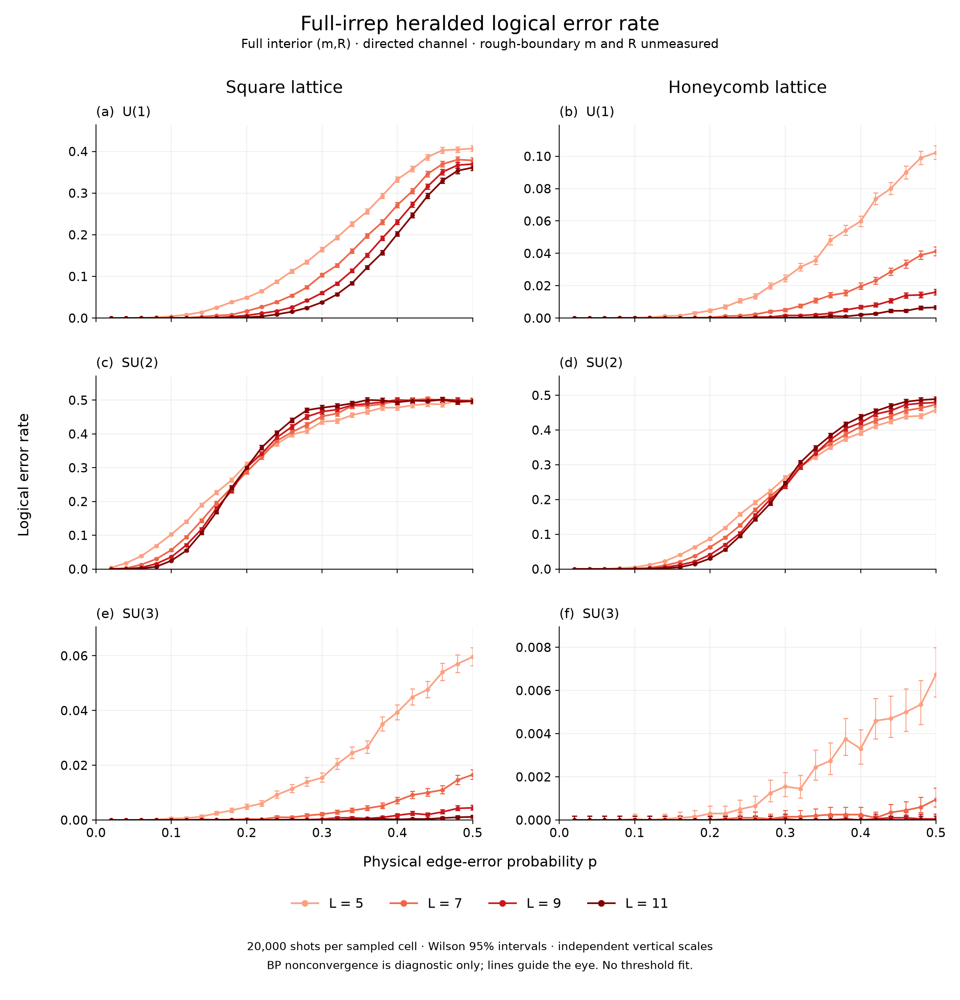
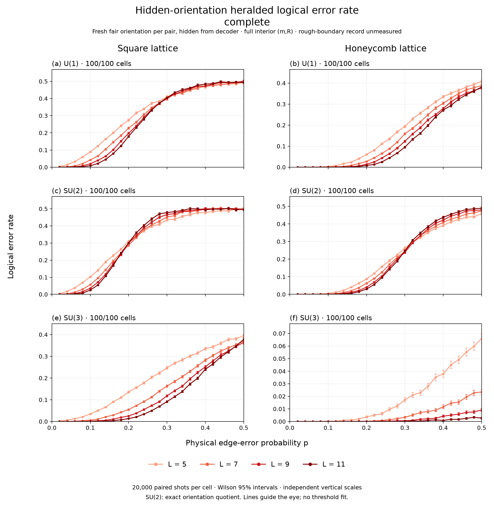

# Lab 006 — SU(N) full-irrep belief propagation

## Overview

### L006.1 Motivation

Determine how symmetry-resolved heralding changes a practical topological
decoder, and why the observed behavior differs between U(1), SU(2), and SU(3).

### L006.2 Background and key notation

An active edge carries a fundamental/antifundamental pair. The decoder sees
exactly the interior binary syndrome m and full fused irrep R; rough-boundary
m and R are unmeasured. Directed errors have a fixed pair orientation;
“undirected” means a fresh fair orientation shared by both endpoints and hidden
from the decoder. It does not change the matching graph.

Belief propagation (BP) estimates activity probabilities r, which become
log-odds weights log[(1-r)/r] for minimum-weight perfect matching (MWPM).
This soft-to-hard decoding step produces a correction with the supplied syndrome;
logical error rate (LER) counts failures of that final correction. BP
nonconvergence is a separate diagnostic, never an additional logical failure.

### L006.3 Question and frozen configuration

How do group, lattice, and pair orientation affect full-record belief matching?
The final scans use square/honeycomb patches, L=5,7,9,11, p=0.02–0.50 in
steps of 0.02, 20,000 trials per cell, damping 0.5, 300 BP iterations,
and posterior-LLR PyMatching. These are finite-size, decoder-specific studies.

### L006.4 Hypothesis and final algorithm

Full-irrep conditioning changes useful edge beliefs. Self-conjugacy may explain
why orientation matters for U(1)/SU(3) but not SU(2); its connection to transition
behavior and hard decoding remains open. The final pipeline is normalized local
fusion likelihood → damped sum-product BP → activity LLR → syndrome-constrained
MWPM. The [method page](../../wiki/methods/sun-fusion-herald-belief-propagation.md)
owns the derivation; tree exactness does not extend automatically to loops.

## Evidence

### L006.5 Registered result summary

| Foundation | Established boundary |
| --- | --- |
| Exact inference | Tree BP matches enumeration; the SU(3) plaquette exposes loop correlations. |
| Executable decoder | Validated Numba acceleration preserves beliefs; all 16 registered hard-decoding checks clear the supplied syndrome. |
| Numerical convergence | An earlier 128-observation, 80-iteration scan exposed geometry-dependent failures; it is separate from the final 300-iteration LER scans. |

The [method evidence](wiki/overview.md) owns these bounded implementation results.

### L006.6 Reader-facing artifact

The [interactive fusion-aware workbench](figures/fusion-belief-matching.html)
shows the observation, posterior change, correction, and convergence diagnostics.
Its validated scope is recorded in the [method overview](wiki/overview.md).

### L006.7 Evidence map

- [Directed rate curves and scoring boundary](wiki/ler-curves.md)
- [Paired orientation effects and diagnostics](wiki/hidden-orientation.md)
- [Final interpretation and theory handoff](wiki/interpretation.md)

### L006.11 Full-record logical error rate curves

All six directed panels are complete: 600 cells and 12,000,000 trials.
SU(2) shows crossing-like size reversals on both lattices; U(1)/SU(3) have no
similarly clear common crossing on this grid. This is a curve-shape observation,
not a threshold estimate. The [directed evidence page](wiki/ler-curves.md)
owns the counts, confidence intervals, diagnostics, and provenance limits.

*Figure L006.11.7. Directed pair errors with full interior (m,R): Square left, Honeycomb right; U(1), SU(2), SU(3) top to bottom. Red darkens with L=5,7,9,11; x is shared and vertical ranges differ by panel. Wilson 95% intervals use 20,000 trials per sampled cell. Lines guide the eye; no threshold fit. Data: [audited inputs and panel mapping](results/a8-ler-overview-render.json).*

### L006.12 Hidden pair orientation

All 600 paired cells are complete, totaling 12,000,000 paired trials. Every
directed replay matches the corrected baseline. SU(2)'s 4,000,000 paired trials
have identical records, failure flags, and convergence flags. For U(1)/SU(3),
313/400 cells show increased LER after Holm-corrected paired tests, with no
significant decrease. The [orientation evidence](wiki/hidden-orientation.md)
owns the complete audit and the separate paired-effect/nonconvergence figures.

*Figure L006.12.1. Hidden fair pair orientation on the matched activity/syndrome stream, with the same measured sites and final-correction score. The R-record law changes for U(1)/SU(3); SU(2) uses its exact orientation quotient. Each panel contains all 100 cells, four sizes, and pointwise Wilson 95% intervals. The curves expose group- and geometry-dependent merging or crossing, not an assigned transition class. Data: [complete inputs and figure hashes](results/a9-figure-inputs.json).*

## Analysis

### L006.8 Implications

The central contrast is SU(2)'s exact orientation invariance versus the strong
orientation sensitivity of U(1)/SU(3). SU(2)'s fundamental is equivalent to its
antifundamental (pseudoreal); the nonzero U(1) charges and SU(3) fundamental pair
are inequivalent. This explains the local quotient in this model, but not yet
why the practical size curves differ. Honeycomb improves LER relative to square
in the illustrated p=0.30 slice for all three groups and both channels; geometry
must enter the explanation. See the [final interpretation](wiki/interpretation.md).

### L006.9 Limitations

The four sizes and fixed BP schedule establish neither an asymptotic threshold
nor its absence. In particular, hidden square U(1)'s merging curves are a
KT/BKT-like hypothesis, not a diagnosed transition; substantial BP
nonconvergence is a competing explanation. Exact edge marginals also need not
make MWPM the optimal logical-sector decoder. Equal nominal L does not equalize
lattice resources, and randomizing orientation changes the R-record law.
These limits and inherited provenance caveats are owned by the
[current interpretation](wiki/interpretation.md).

### L006.10 Next question

Why does self-conjugacy distinguish SU(2) from U(1)/SU(3), and how does that
local distinction affect logical-sector inference and hard matching? Derive
the corresponding statistical-mechanics model, then distinguish conventional,
KT/BKT-like, and algorithmic explanations. This question moves to
[Lab 007](../lab-007-decoding-statistical-mechanics/PLAN.md), with Lab 006 as its
parent. The specific direction-biased U(1) extension now has its own
[Lab 008](../lab-008-direction-biased-u1-current-channel/PLAN.md), also derived
from Lab 006. Lab 007 is its general mapping dependency. See the updated
[interpretation and handoff](wiki/interpretation.md).
