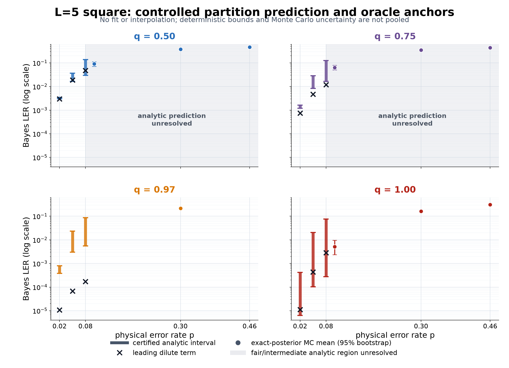
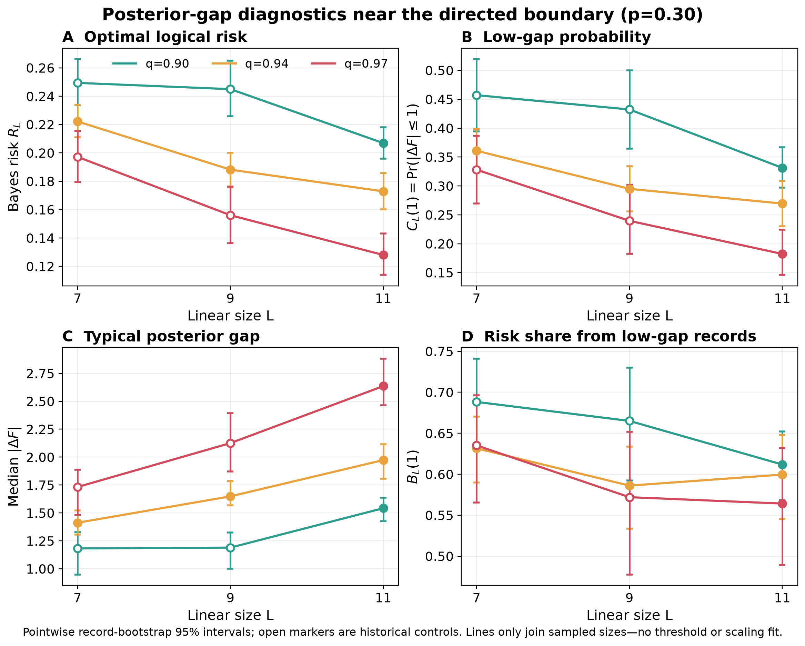

# Direction-biased U(1) current channel

## Overview

### L008.1 Motivation

Lab 006's directed and hidden-fair U(1) LER curves differ substantially.
Lab 008 now finds this contrast in optimal sector inference, with additional
BP/MWPM loss. Lab 006 is the experimental parent; Lab 007 supplies the method.
The current priority is the decoding phase transition and correction threshold.
Thermodynamic proofs give correctable regions. Further size acquisition is
stopped; the active task is a uniform theory of logical-interface ambiguity.

### L008.2 Background

The undirected lattice model has link field $h=0$: no preferred edge direction, while signed integer charge $Q$ remains observed and reference arrows are coordinates.
At fixed jump rate $p$, $q=(1+\tanh h)/2$ tunes toward one-way noise; the decoder scores binary logical parity with rough endpoints.

### L008.3 Question

What is the thermodynamic decoding behavior of the undirected model, and how does a continuous link field change it? Can physical partition ratios yield uniform correction bounds and identify the role of bias near a critical point?

### L008.4 Hypothesis

Bias changes sector free-energy gaps; BP and matching add loss. Finite-patch evidence supports both components and rejects a purely algorithmic origin.
Linear gap growth, slower divergence and an eventual plateau remain competing thermodynamic hypotheses in the theory program below.

## Evidence

### L008.5 Exact bridge to LER

$$\mathrm{LER}_*=\mathbb E_Q\!\left[\frac{1}{1+e^{|\Delta F(Q)|}}\right],\qquad \Delta F=\log(Z_0/Z_1).$$

The actual decoder's conditional risk is its posterior probability of choosing the wrong sector; its excess over Bayes is nonnegative on every record. The oracle passes 2,334 exhaustive cases and 282 response checks. [Derivation and validation](wiki/sector-predictions.md).

### L008.21 Thermodynamic correctability and free energy

Square initial-threshold lower bounds are $0.05904145$ at $q=1/2$ and $0.12732200$
at $q=1$. For every fixed honeycomb $q>0.9925857155$, or its reflected interval,
\[
\sup_{0\leq p\leq1}R_{*,L}(p,q)\leq C(q)L e^{-k(q)L}\longrightarrow0.
\]
The proof joins current and activity-complement path bounds using honeycomb
walk growth. These are sufficient regions, not sharp phase boundaries. The
bulk-density limit cannot determine LER; the sector gap must diverge in
probability. [Proofs and exact controls](wiki/thermodynamic-limits.md).

### L008.22 Directed square midpoint and the threshold obstruction

At $p=1/2$, $q=1$, opposite-sector support is exactly a residual directed crossing.
Its bond-percolation cluster law and RSW keep ambiguous records present at
large L, but nonzero LER still needs posterior balance. All supported currents
have equal weight, so this gap is an entropy difference between the two sectors.
Matching, transport and replica audits do not establish a size-uniform
balance estimate. The square midpoint's limiting LER remains unresolved.
[Threshold definitions, mapping and evidence](wiki/decoding-thresholds.md).

### L008.24 Uniform interface criterion and gluing

For $G=|\log(Z_0/Z_1)|$, exponential LER decay is equivalent to a uniform exponential lower-tail bound. Exact gluing retains hidden interface flux $U$.
If $d_Q$ is total variation between its two sector-conditioned laws, the extra
risk from hiding $U$ obeys $c(Q)\le r(Q)d_Q$ exactly. In natural units it also
obeys $\mathbb E c\le\sqrt{R_L I(H;U\mid Q)}$. But for a straight square
separator, charge conservation makes $H$ the parity of known $Q$ and complete
$U$. Thus $d_Q=1$ on ambiguous records. Parity quotienting preserves gluing;
residual-directed path flips also preserve $Q$ and switch sector exactly.
But the all-zero state forces action distortion at least $\max\{(p/(1-p))^{L-1},((1-p)/p)^{L-1}\}$ for $p\ne1/2$; at $p=1/2$, an all-size row construction proves the frozen rule has inverse multiplicity at least $L$.
An alternative that preserves the physical signed-charge record reveals its sites sequentially: sector affinity $F_k$ is the geometric-mean-weighted conditional affinity, and the full absolute contrast satisfies $1-2F_m\le A_L\le\sqrt{1-4F_m^2}$. All 18 exact $L=3$, $p=.30$ controls pass, but some fair-noise prefixes have conditional affinity one. At the full record, $F_m=\frac12\mathbb E_P[\operatorname{sech}(G/2)]$ for the already studied posterior gap $G$; recomputing it from old gap samples would not be independent evidence. The full bulk-charge record is exactly independent of logical parity. If $r$ cut-adjacent charges remain unobserved, the partial-record absolute contrast is at most $|1-2p|^r$. Conversely, with bulk charges hidden, even the complete strip has contrast at most $\delta(p,q)^L$ for an exact $\delta<1$. A rare but positive-probability *joint* public record pins the interface currents and then determines logical parity exactly, so that strip-only bound cannot hold uniformly after conditioning on the bulk. The event is exponentially rare and does not classify the physical average: the $p=.30$ thermodynamic phase remains unresolved.
[Exact theorem and assumptions](wiki/thermodynamic-decoding-theory.md).

### L008.18 Connected defects and finite controls

Convexity turns logical failure into a unit-current path witness, improving
biased Bayes bounds. The directed $L=3$ curve for $p\leq .2$ is exactly
$$6p^2 - 12p^3 + 13p^4 - 14p^5 + 7p^6 + 2p^7 - 2p^8.$$
certified by rational signs of all 64 record-sector differences.

An independent-strip floor proves the witness union exceeds $0.68679$ at fair
$L=5$, $p=.30$, so overlap removal alone cannot give a bound below one half there.
This floor is not a Bayes lower bound. [Finite proofs and envelope limits](wiki/connected-current-defects.md).

### L008.19 The singular directional crossover

For $1-q=\lambda p^\alpha$ at fixed square size $d=L-1$, the exact LER exponent is
$$\min_{k=0,\ldots,d}\max\!\bigl(k,(1+\alpha)(d-k)\bigr).$$
The directed exponent $d$ requires $\alpha\geq d-1$. At the boundary layer
$1-q=\lambda p^{d-1}$, the exact coefficient of $p^d$ is
$$\binom{2d}{d}+Ld\lambda+(L-2)d\min(\lambda,1).$$

For $L=5$ this is $[70+20\lambda+12\min(\lambda,1)]p^4+O(p^5)$; $\lambda=1$ gives
$102$ rather than the directed coefficient $70$. Exact sector counting verifies
$12$ exponents and $15$ coefficients on $L=3,4,5$. This is a low-noise theorem,
not a moderate-p fit or threshold. [Proof and checks](wiki/directional-crossover.md).

### L008.20 Normalized fixed-p response

At zero field, $Z_a(Q;h)=Z_a(Q;0)\mathbb E_{0|Q,a}[e^{hJ-N\log\cosh h}]$. Reflection cancels non-tied linear risk terms, but ties give $R'_L(0+)=-\frac12\sum_{D_Q(0)=0}|D'_Q(0)|$; exact L3 cusp magnitudes are $151263/10^6$ at $p=.3$ and $3/64$ at $p=.5$. This identifies joint current/activity/tie statistics, not thermodynamic relevance.
Exact KL comparison gives $|R_L(h)-R_L(0)|\le\sqrt{Ep\kappa(h)/2}$, so $h_L\sqrt{E_L}\to0$ is universally perturbative and the cusp is at most $\sqrt{Ep}/2$. For fixed $h\ne0$, however, the complete current laws separate exponentially in TV; observable-specific boundary structure is required.
For $\epsilon=1-q$, the normalized joint law retaining zero and one reverse jump has exact error certificate
$$\operatorname{TV}=Ep\epsilon\bigl[1-(1-p\epsilon)^{E-1}\bigr]\leq E(E-1)p^2\epsilon^2.$$
Bayes LER is 1-Lipschitz in this TV distance. All $15$ exact full-support $L=3$
cells pass, including $96$ newly accessible records and finite-$\epsilon$ sector
switches; the largest observed LER error is $0.0005931$. $E=32$ values are bounds
only, not an evaluated $L=5$ curve. [Fixed-p response proofs](wiki/thermodynamic-decoding-theory.md).

### L008.15 Replica boundary observable and exact limits

Let $m=(Z_0-Z_1)/(Z_0+Z_1)$, and $M_2=\mathbb E[m^2]$ under the physical charge-record law.
Then $(1-M_2)/4\leq\mathrm{LER}_*\leq(1-M_2)/2$: $M_2$ tends to one exactly when optimal
LER vanishes. Higher even moments reconstruct LER with a certified remainder.
The local replicated rotor model is explicit, but the physical ratio needs
$R\to1$; the clean $R=2$ model instead weights records by $P(Q)^2$.

The solved long-path decay rate at $p=.30$ is $0.433750$ for fair noise and
$1.203973$ for directed noise. Revealing all vertical currents yields the square
bound $\mathrm{LER}_*\geq[1-(1-2\mathrm{LER}_{\mathrm{path}})^L]/2$. These are analytic results, not fits.
Twelve channel checks and two-/three-replica integrals agree within $5\times10^{-16}$.
[Proofs, formulas and checks](wiki/replica-boundary-ratios.md).

### L008.16 Complex weights and the conformal route

Primary literature supports a replica boundary-defect approach: physical
moments of twisted partition ratios, compact-boson/vortex analysis and,
if a fixed point is identified, boundary spectra and characters. Complex
edge weights alone do not imply a nonunitary or complex CFT. A Gaussian
replica ratio and LER series are evaluated exactly under stated continuum
and continuation assumptions, with an explicit root-lattice compactification.
Their applicability to this rough square is unproved. No $2$D critical noise
rate or critical LER value is claimed. [Literature and calculation route](wiki/complex-weights-and-cft.md).

### L008.17 Earlier controlled prediction boundary

The annulus calibration is rejected: bare curvature is not renormalized
stiffness, vortex fugacities are uncontrolled, and integer replicas do not fix
$R\to1$. Positive-current certificates control every $q$ through $p=.05$. At $p=.08$,
adaptive contraction narrows only $q=.97,1$; fair/intermediate bias remains broad.

*Figure L008.17. Earlier $L=5$ certificates, dilute terms and exact-posterior Monte Carlo anchors on a log scale. No fit or pooling; the new connected-defect bounds are reported above. Data: [partition-function evidence boundary](wiki/partition-function-ler.md).*

### L008.11 Square: intrinsic ambiguity and decoder loss

At $p=.30$, the fair-minus-directed Bayes contrast is $0.21610$
$[0.19901,0.23222]$ for $L=5$ and $0.27744$ $[0.26303,0.29203]$ for $L=7$ (paired $97.5\%$
intervals for the two registered primary comparisons). The corresponding
BP-MWPM contrasts are $0.23911$ and $0.32433$. Most of the difference is intrinsic;
decoder excess contributes too.

*Figure L008.11. Square $L=5,7$; $n=512$ at $p=.30$ and $192$ elsewhere; pointwise bootstrap $95\%$. Lines join three sampled $p$ values, with no threshold fit. Data: [mechanism evidence](wiki/mechanism-results.md).*

### L008.6 Actual arrow geometry and its control

Square stored arrows form a gradient; honeycomb stored arrows have a cycle
obstruction. On the same honeycomb graph, replacing stored arrows by
bipartite gradient arrows increases directed Bayes LER by $0.03996$
$[0.01206,0.06673]$ at $L=3$ and $0.02570$ $[0.00976,0.04300]$ at $L=5$.
These exploratory intervals are pointwise 95%. Bulk and boundary arrows both
change, so this does not isolate flux. Fair reparameterization controls pass
to rounding precision.

*Figure L008.6. Same honeycomb graph and $p=.30$, two preferred direction patterns; $n=256$ per cell, pointwise bootstrap $95\%$. Data: [mechanism evidence](wiki/mechanism-results.md).*

### L008.13 Withheld size and near-directed noise

At withheld square $L=9$ and $p=.30$, Bayes LER is $0.34301$ for $q=.5$, $0.15603$ for
$q=.97$, and $0.04599$ for $q=1$. The paired fair-minus-directed contrast is $0.29702$
$[0.27568,0.31719]$ ($97.5\%$). Ambiguous records with $|\Delta F|\leq1$ fall from $0.74479$
to $0.23958$ to $0.02604$. The final fair $L=7$-to-$L=9$ size step remains unresolved.

*Figure L008.13. At $p=.30$: risk intervals are bootstrap $95\%$, ambiguity fractions Wilson $95\%$; $n=512$ for $L=5,7$ at $q=.5,.75$, $n=256$ at higher $q$, and $n=192$ at $L=9$. Data: [mechanism evidence](wiki/mechanism-results.md).*

### L008.14 Analytic prediction from the auxiliary model

The logical-cut twist of the $K$ integral yields both sector partition sums
and the optimal LER directly. Minimal-defect counting on the actual square
now predicts the following first terms as $p$ tends to zero at fixed $L$:

| Size | Fair noise $q=1/2$ | Directed noise $q=1$ |
| --- | --- | --- |
| $L=5$ | $7.5p^2$ | $70p^4$ |
| $L=7$ | $17.5p^3$ | $924p^6$ |
| $L=9$ | $39.375p^4$ | $12870p^8$ |

The powers and coefficients are derived, not fitted. An exact path formula,
Fourier projection checks and small-square expansions support the analytic
derivation. This is a dilute-limit explanation, not a solved moderate-p curve or phase classification. [Derivation and evidence boundary](wiki/partition-function-ler.md).

## Analysis

### L008.8 Implications

The statistical model explains LER through the distribution of posterior
logical-sector ambiguity. For fair square $L=9$, $p=.30$, the measured decomposition
is Bayes $0.34301$ + decoder excess $0.05417$ = practical $0.39718$, consistent with
the parent's curve near $0.40$. Both intrinsic ambiguity and practical loss
matter; nonconvergence alone does not explain the curve. [Interpretation](wiki/mechanism-results.md).
### L008.9 Limitations

The thermodynamic criteria are sufficient regions, not a full phase diagram.
The finite-graph risk change is bounded by $1-[1-p(1-q)]^E$; at
$L=9$, $p=.30$, $q=.97$, the mean reverse-edge count is $1.152$. Neither endpoint nor gauge
mapping proves no transition or establishes BKT scaling. [Evidence limits](wiki/mechanism-results.md).
### L008.23 Next question: what the finite-size data leave open

At $p=.30$, all three $q$ trajectories have lower risk and $C_L(1)$, and higher median and lower-quartile gap, from $L=7$ to $L=11$. The $L=11$-minus-$L=7$ risk changes are $-0.0425$ $[-0.0619,-0.0225]$, $-0.0493$ $[-0.0661,-0.0317]$, and $-0.0692$ $[-0.0922,-0.0457]$ for $q=.90,.94,.97$. $B_L(1)$ does not increase, so rare-tail takeover is unsupported through $L=11$. These observations motivate a growing-gap hypothesis but cannot choose its asymptotic scale or exclude a later plateau. Further acquisition is stopped. For the pure-gradient square field, sector response is an exact rough-charge generator ratio at shifted zero-field activity. Pointwise, boundary-only and signed-average shortcuts fail: the unweighted boundary parity tends to certainty while true global parity tends to fairness. Existing path proofs certify the physical absolute contrast tends to one in strict low- and high-$p$ wedges, but do not cover the $p=.30$ question. Optimizing a single pathwise Chernoff exponent cannot repair that gap: its best nonbacktracking transfer radius is still above one at $p=.30$, even in the fully directed limit. This rejects a proof shortcut, not a phase. [Theory and competing outcomes](wiki/thermodynamic-decoding-theory.md).

*Figure L008.23. Pointwise record-bootstrap $95\%$ intervals; open points are unpooled historical controls. Lines join sampled sizes only. Data: [analysis](results/posterior-gap-boundary-tail-analysis-2026-09-21.json); [limits](wiki/decoding-thresholds.md).*
