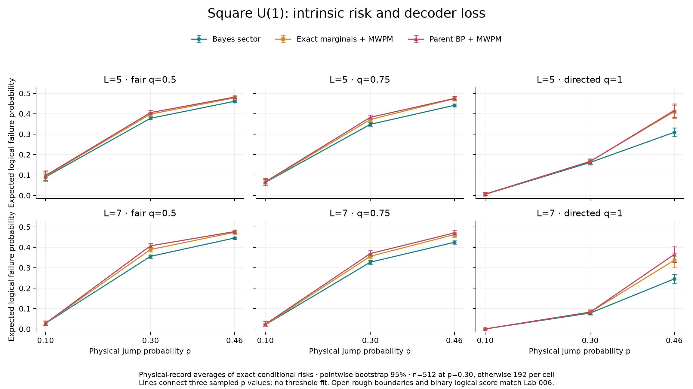
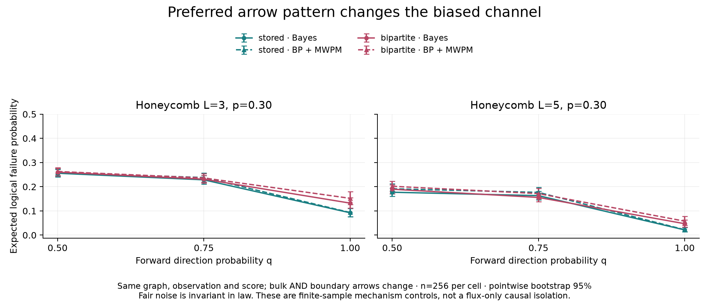
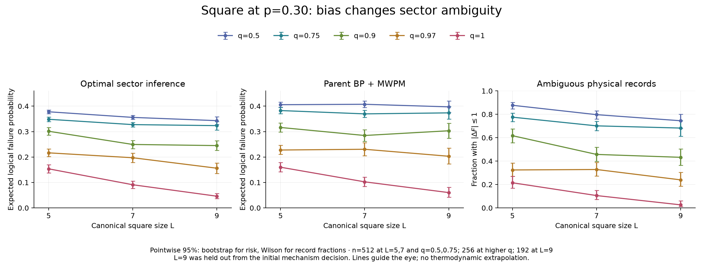

# Intrinsic risk, decoder loss and bias controls

## Summary

The directed/fair U(1) contrast seen in Lab 006 has a substantial intrinsic
component: it already appears in optimal logical-sector inference. Matching
and approximate BP introduce additional loss. This conclusion survives a
withheld larger square patch. Preferred arrow patterns also matter on the
same honeycomb graph. These are finite-patch mechanism results, not a phase
diagram or a proof of the absence of a directed-channel transition.

## Evidence

### Model and independent oracle validation

Every comparison uses the parent's canonical graph, full interior integer
charge, unmeasured rough endpoints and binary residual logical parity. The
channel has edge probabilities (1-p,pq,p(1-q)); p,q and the preferred arrows
are known to the decoder. Each sampled record is passed to exact sector
inference, exact-marginal MWPM and parent-schedule BP-MWPM. Conditional failure
probabilities are averaged over independent physical records. This estimates
the same LER as realized failure counts with less sampling noise; the raw
files retain both, and conditional Bernoulli calibration guards pass.

The oracle contracts finite positive-current factors with no bond truncation.
It sums rough-endpoint charges and inserts each edge prior once. Internally
it labels absolute logical-cut parity; for fixed Q this only relabels the
relative sectors. The inference result, chosen correction and score use the
same convention. The numerical error is floating-point rounding, separate
from Monte Carlo uncertainty in the physical-record average.

The [validation record](../results/response-oracle-validation-2026-09-18.json)
checks 2,334 exhaustive record/channel cases, 282 response derivatives
(maximum error 4.91e-10), independent honeycomb sweep orders, and exact replay
of the parent record generators and endpoint BP routines. The generalized
ternary prior also agrees with the parent's fair endpoint. The parent schedule
is frozen at 300 iterations, damping .5 and tolerance 1e-10; matching uses the
same clipping and PyMatching backend. No decoder schedule is tuned here.

The [mechanism controls](../results/mechanism-controls-2026-09-18.json) also
verify independent sector current moments and 64 fair-channel arrow
reparameterizations to about 1e-15. Square L=3 is excluded from practical
evidence: duplicate detector columns make its matching objective disagree
with exhaustive binary minimization on 27/40 diagnostic records. All retained
production graph sizes pass the duplicate-column check.

The final [scientific integrity audit](../results/scientific-integrity-2026-09-18.json)
reconstructs every saved current from its registered seed, checks all charges,
scores and reported means, verifies source/input hashes, and replays one record
per production cell with zero risk discrepancy. Fifteen exhaustive small-graph
checks also satisfy the derived endpoint-continuity bound.

### Stage 2: square LER decomposition

The [first production analysis](../results/square-mechanism-2026-09-18-analysis.json)
contains 18 cells at L=5,7, p=.10,.30,.46 and q=.5,.75,1. There are 512 records
per p=.30 cell and 192 elsewhere, totaling 5,376. Activity and sign uniforms
are shared across q at each L,p; charges are regenerated under the correct
channel law. All three decoders within a cell use identical records.

At the registered primary p=.30:

| L | q | Bayes LER | Exact-marginal MWPM | Parent BP-MWPM |
| --- | --- | --- | --- | --- |
| 5 | .50 | .37784 | .39841 | .40571 |
| 5 | .75 | .34836 | .37188 | .38264 |
| 5 | 1 | .16174 | .16717 | .16660 |
| 7 | .50 | .35578 | .38946 | .40739 |
| 7 | .75 | .32740 | .35646 | .36962 |
| 7 | 1 | .07833 | .08267 | .08306 |

The paired fair-minus-directed Bayes contrasts are .21610
[.19901,.23222] at L=5 and .27744 [.26303,.29203] at L=7. These are per-size
97.5% bootstrap intervals, using a Bonferroni allocation for the two original
primary comparisons. BP-MWPM contrasts are .23911 and .32433. Thus most of the
observed endpoint contrast is already intrinsic. The difference in BP excess
risk adds .02301 [.01668,.02953] and .04689 [.03762,.05656], with pointwise
paired 95% intervals. Both mechanisms contribute; the pure algorithm-artifact
explanation is rejected for these cells.

Figure: exact conditional-risk averages, pointwise bootstrap 95%; lines
connect only three sampled p values. The larger practical loss at directed
p=.46 is also visible: at L=7 Bayes=.24535, exact-marginal MWPM=.33673 and
BP-MWPM=.36509. This is not a threshold estimate. The two MWPM risks need not
be ordered, even though each is bounded below by Bayes record by record.

### Stage 3: preferred arrows on the same honeycomb graph

The [arrow-control analysis](../results/honeycomb-arrow-control-2026-09-18-analysis.json)
uses L=3,5, p=.30, q=.5,.75,1, 256 records per arrow/cell, totaling 3,072.
Stored arrows are compared with arrows from one bipartition to the other;
the latter unit field is a gradient. Edge indices, graph, logical cut and
observation budget are unchanged. Bulk AND boundary directions change.

At q=1 the bipartite-minus-stored Bayes differences are .03996
[.01206,.06673] for L=3 and .02570 [.00976,.04300] for L=5, with exploratory
pointwise paired 95% intervals. At q=.5 and .75 these intervals include zero.
Fair-channel equivalence is stronger than a null sample result: relabeling
each physical current under arrow reversal passes an exact posterior/BP
control. Production fair samples have the same law but are not identical
physical realizations, so small empirical differences are expected.

Figure: pointwise bootstrap 95%, n=256 per cell. The result establishes
direction-field sensitivity of the biased channel. It does not isolate local
gauge flux from boundary tilt and does not prove a square/honeycomb advantage.

### Stage 4: withheld size and near-directed noise

The [extension analysis](../results/size-bias-extension-2026-09-18-analysis.json)
adds 2,496 records: L=5,7 at q=.9,.97,1 with n=256, and withheld L=9 at
q=.5,.75,.9,.97,1 with n=192, all at p=.30. Streams are independent of Stage 2;
the new q=1 cells are replication, not pooled with the earlier endpoint.

At L=9, Bayes risks at the five q values are .34301,.32341,.24496,.15603,.04599;
BP-MWPM risks are .39718,.37357,.30325,.20305,.06018. The paired fair-minus-
directed Bayes contrast .29702 [.27568,.31719] replicates the intrinsic
mechanism on this withheld size (97.5% interval). The paired q=.97 minus q=1
Bayes contrast is .11004 [.09060,.12998] (exploratory 95%).

The [distributional analysis](../results/size-bias-distributions-2026-09-18.json)
also tracks full gap-CDF summaries and posterior logical entropy. At L=9 the
fraction with |DeltaF|<=1 falls from .74479 (fair) to .23958 (q=.97) and .02604
(directed). This is direct evidence for changed sector ambiguity, beyond a
change in a mean gap. Fixed-record responses have both signs, consistent with
the absence of a universal pointwise monotonicity theorem.

Figure: pointwise bootstrap 95% for risks and Wilson 95% for ambiguity fractions.
L5,L7 at q=.5,.75 use Stage 2; all other points use Stage 4. The independent
L9-minus-L7 Bayes change at q=.5 is -.01277 [-.02997,.00342], so the last fair
size step is unresolved. At q=1 it is -.04502 [-.06252,-.02697]; this finite-size
decrease does not settle its asymptotic limit. No scaling model was fitted.

### What this explains about the parent's curves

The observed LER is the sum of intrinsic sector risk and decoder excess risk.
The fair square channel has large ambiguity even under optimal inference,
while BP/MWPM raises the risk further. At p=.30, L=9 the decomposition is
.34301 + .05417 = .39718. This is consistent with the inherited practical
curve near .40, but it cannot turn a finite-size plateau into a phase claim.
New samples are independent of the parent trials, not a replacement of them.
BP nonconvergence is a diagnostic only: here it is .96875 at fair L=9 and
.90104 at directed L=9 despite their very different LERs.

The finite-graph Bayes risk remains continuous at q=1. The
[coupling bound](sector-predictions.md) is
|LER*(q)-LER*(1)| <= 1-[1-p(1-q)]^E. At q=.97 the expected number of reverse
edges is .288,.648,1.152 for square L=5,7,9. A bias close to one is therefore
not uniformly a small perturbation of the entire record as size grows.

## Status

All four authorized stages are complete within the stated finite-mechanism
scope. Production contains 10,944 record comparisons across 41 cells, with
frozen manifests, checkpointed raw currents/charges/risks, source hashes,
realized-failure companions and uncertainty. Purely algorithmic origin is
rejected for the registered square primary cells; intrinsic ambiguity and
algorithmic loss coexist. Honeycomb direction-field sensitivity is supported
at its directed endpoint. The infinite-size phase class remains unclassified.

The researcher has since clarified the priority: first explain the LER curve
from the auxiliary partition function. The [analytic follow-up](partition-function-ler.md)
now derives the exact twist observable and low-noise square powers and
coefficients; its moderate-p extension is the primary unfinished task.
Asymptotic phase behavior and separate boundary/bulk interventions are
secondary. The present numerical data do not justify a BKT fit, a transition
threshold, or a no-transition claim.

## Related pages

- [Sector predictions and the LER connection](sector-predictions.md)
- [Direction-biased U(1) current channel](direction-biased-u1-current-channel.md)
- [Inherited evidence and experiment rationale](numerical-evidence.md)
- [Executed research plan](../PLAN.md)
