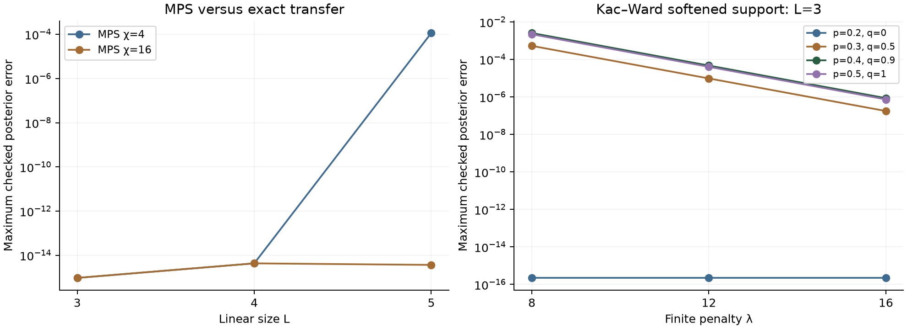
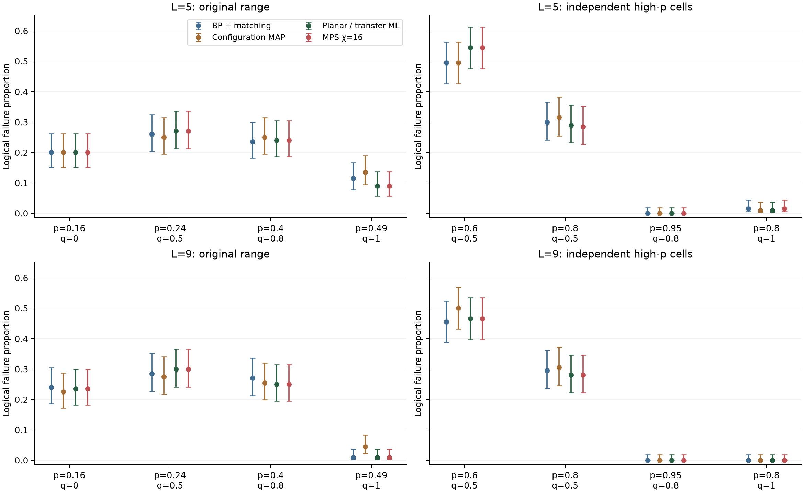
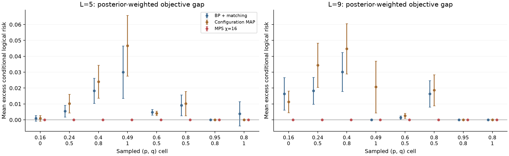
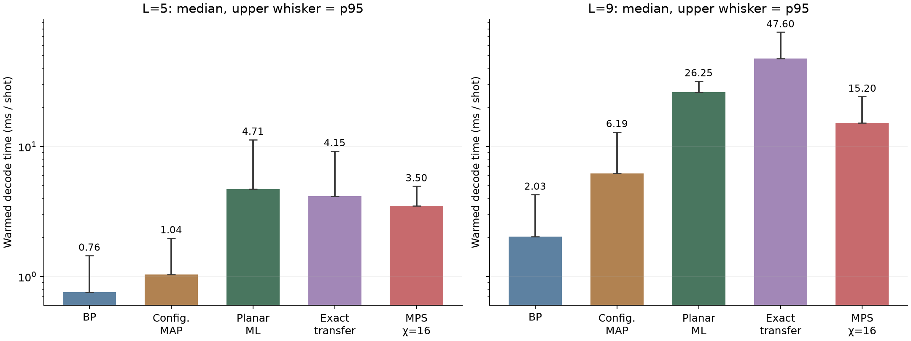

# Lab 009 — Planar herald decoder survey and integration

## Overview

### L009.1 Motivation

The reusable decoder collection now includes configuration MAP, planar logical ML, exact transfer and controlled MPS alongside BP plus matching. This lab consolidates their theory, checks the implementations on the same observation law, and reproduces the numerical evidence without rerunning large campaigns. A finite-penalty Kac–Ward implementation remains a research comparison.

### L009.2 Background

The model has IID binary edge errors, exact detector parity and conditionally independent herald coins for local counts at least two. Rough tips are unmeasured. The success criterion is a valid syndrome correction with trivial residual logical parity; reconstructing the sampled errors or reproducing heralds in the correction is unnecessary. The current research domain is **p,q in [0,1]**. Incomplete heralds do not generally possess complement symmetry. [Model and loss](wiki/model.md).

Lab 002 supplies the BP/LLR baseline, Lab 003 supplies measured finite-window trends, and Lab 007 supplies the sector formulation. This lab studies correlated logical-sector inference and its finite-size performance. The [local theory wiki](wiki/index.md) derives the edge/site weights, matching reductions, partition functions and limitations; [source documentation](../../src/herald_decoder/README.md) gives the reusable API.

### L009.3 Question

Which distinct inference methods can become standard algorithms, what performance and efficiency do matched records establish, and what are the limits of this finite-size pilot?

### L009.4 Hypothesis

Parity-fixed degree-two/three planar factors admit exact matchgate sector sums. Configuration MAP is useful but need not outperform BP. Transfer independently checks the sums; finite-width MPS and finite-penalty Kac–Ward require approximation qualifications. The matched pilot measures finite-size objective and runtime differences without a heavy phase sweep.

## Evidence

### L009.5 Reusable methods and system integration

Four new source classes are exposed by `make_decoder(graph, method, p=p, q=q, ...)`. They share the existing geometry and visible record. The common correction API and standard selector are exercised by the [interactive decoder artifact](results/decoder-workbench.html); [method survey](wiki/comparison.md) explains the objective differences.

| Standard method | Optimized quantity | Scope and limitation |
| --- | --- | --- |
| BP + matching | Approximate edge marginals, then LLR projection | Existing square/honeycomb API; convergence and projection loss |
| Configuration MAP | Posterior of one complete configuration | Exact integer minimizers below half; literal floating weights above half, subject to backend precision |
| Planar ML | Sum over each logical sector | Algebraically exact trivalent planar factors; numerical gates |
| Exact transfer | Sum over each logical sector | Independent binary contraction; exponential frontier width with caps |
| MPS | Approximate logical-sector sums | Honeycomb column contraction; finite χ and truncation diagnostics |

MAP returns a hard-valid configuration. Sector methods return a syndrome-compatible representative in the selected absolute sector and a posterior when available. A generic planar binary-factor API also supports a validated full-irrep fixture. It does not claim to solve arbitrary fusion, degree-four factors or noisy spacetime channels.

### L009.6 Correctness and approximation gates

Independent weighted whole-error enumeration checks 283 supported size-two record/parameter cases, including both deterministic priors, q endpoints and extreme priors. Another 216 records at sizes three through five compare planar and transfer posteriors. The generic-factor interface check changes references and edge ordering. Eight regression groups also check batches, resource caps, signed costs, exact q=1 MAP counts, an SU(2) local-factor fixture and BP factory compatibility. No assertion is based on matching a historical phase guide. [Planar derivation and numerical scope](wiki/planar-ml.md).

*Figure L009.1. Maximum checked posterior discrepancies; these are sampled diagnostics, not rigorous risk bounds. MPS χ=4 loses accuracy at size five; χ=16 agrees there to roundoff. Finite Kac–Ward penalties soften forbidden configurations. Display floor is 10⁻¹⁷; data: [validation receipt](results/validation.json).*

The fresh size-nine cohort agrees between planar and exact transfer to numerical precision. χ=16 MPS also agrees closely in this cohort, but remains approximate. Equal-risk sector ties can give different failure vectors even when total counts coincide. Numerical failures are explicit; records must not be silently dropped. Kac–Ward is excluded from the standard selector because its current finite penalty changes the likelihood support.

### L009.7 Fresh matched performance over the full prior range

The two completed pilot cohorts contain **3,200 independent records**, 200 per cell at sizes 5/9, shared by five methods: 16,000 decoder evaluations. High-p records are independently sampled. There are zero invalid corrections and zero runtime exceptions. Synchronous BP uses 40 iterations and default damping/tolerance; its 2,218 nonconverged records remain in the denominator. [Comparison and scoring](wiki/comparison.md).

*Figure L009.2. Wilson 95% intervals for each 200-record cell. Planar/transfer counts coincide; MPS χ=16 has the same counts in this cohort. The original and independent high-p cells are discrete measurements, without interpolation. Exact ML need not win every realized sample; data: [fresh matched results](results/benchmark.json).*

*Figure L009.3. Mean selected-sector expected loss minus the exact planar conditional Bayes risk, with ±1.96 sample SE over records. This exposes the objective gap when realized counts favor another decoder; it is not an asymptotic uncertainty estimate. Exact reference regret is zero; data: [posterior-weighted comparison](results/benchmark.json).*

MAP does not consistently improve on BP. At L=9, p=.49,q=1 it has 9/200 failures versus 2/200 for BP, planar ML, transfer and MPS. At p=.95,q=.8 all methods have 0/200 failures at both sizes; the Wilson upper limit is about .0188, so zero observed failures does not establish zero limiting risk. The current wrappers reproduce saved decisions/posteriors on three held-out saved records per cell/method, with tie allowances.

### L009.8 Efficiency of the integrated implementations

*Figure L009.4. Median warmed wall time, upper whisker p95, on one CPU thread. Each size/method has 1,600 timings from an equal-size mix of eight cells. Setup and the independent first call are excluded. Values describe these Python wrappers; data: [runtime vectors](data/warm-runtime-summary.csv).*

| Method | L=5 median / p95 ms | L=9 median / p95 ms |
| --- | ---: | ---: |
| BP + matching | 0.76 / 1.45 | 2.03 / 4.27 |
| Configuration MAP | 1.04 / 1.98 | 6.19 / 12.94 |
| Planar ML | 4.71 / 11.31 | 26.25 / 31.83 |
| Exact transfer | 4.15 / 9.25 | 47.60 / 75.76 |
| MPS χ=16 | 3.50 / 4.96 | 15.20 / 24.21 |

Transfer/MPS batch 16 records through vectorized tensor operations; planar/MAP batch paths currently loop. Setup and warm-call receipts are retained per cell. The environment is Python 3.13.2, NumPy 1.26.4 on arm64 macOS. MAP graph reconstruction and repeated graph-property access contribute overhead. This backend is sufficient for the survey; a separate optimization project is not a prerequisite to the scientific conclusion. [Contraction complexity and resource caps](wiki/transfer-mps.md).

### L009.9 Full-domain correction and analytical structure

The complete joint-record size-two oracle gives optimal risks .231775342400 at (.2,.5) and .304423178240 at (.8,.5): an exact counterexample to intermediate-q complement symmetry. At q=0 and q=1 the corresponding endpoint symmetries pass, as do zero risk at deterministic p=0/1. [Complete symmetry audit](results/full-prior-symmetry-audit.json), [current observation model](wiki/model.md).

Perfect heralding fixes each detector count. Logical ambiguity then needs an alternating path joining the rough sides. The honeycomb walk-growth constant is below two, producing a sufficient exponential recovery bound across the full p interval. More generally, the derived sufficient region is μ√(p(1−p))(1+√(1−q))<1. It is conservative and is not the fitted boundary. Herald thinning proves optimal Bayes risk cannot worsen with q; it proves neither p monotonicity nor a unique fixed-q transition.

## Analysis

### L009.10 Implications

The main integration is correlated sector inference with a reusable exact planar formulation, backed by an independent contraction oracle. Integer MAP is an efficient structural baseline below half; MPS offers controlled numerical flexibility; Kac–Ward contributes a useful limiting construction but is not promoted with an exactness claim. [Partition functions and recovery bounds](wiki/statistical-mechanics.md) explain the assumptions behind each conclusion.

The survey has integrated four inference methods, made their code callable, generated the matched comparison figures in PNG plus vector SVG/PDF, and retained matched numerical vectors and hashes. The [data and vector export guide](data/README.md) provides formats and figure downloads. These results supersede the partial full-prior diagnostic as the lab synthesis; historical correction receipts remain provenance. No heavy threshold campaign was repeated.

### L009.11 Limitations

Algebraic exactness does not certify floating-point stability at every size or extreme parameter. Above half, MAP uses literal floating weights and the matching backend's finite numerical resolution. Finite χ is approximate; discarded weight is not a rigorous risk certificate. Finite Kac–Ward penalties soften support. Timings are warmed measurements on this machine with heterogeneous per-cell cost, not an asymptotic speed comparison. [Method and evidence boundaries](wiki/comparison.md).

The matched finite-size pilot cannot establish the full-domain phase topology. Finite-size drift, fit-window sensitivity and different decoder objectives remain separate uncertainties. The broader project's historical tests have known archived-manifest/dependency failures; this lab reports its relevant passing checks rather than claiming the entire repository suite passes. The classical results do not establish decoding performance for hidden-orientation quantum fusion or noisy spacetime channels.

### L009.12 Next question

A separately registered follow-on can compare planar ML with full-irrep binary local factors under an independently validated observation law, or study large-size/full-domain convergence where fresh evidence is missing. The survey/integration deliverable ends here; neither a new phase sweep nor a physical-channel extension is required to reuse these standard methods.
