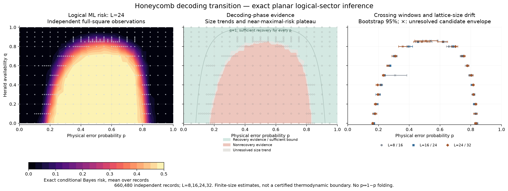

# Full-domain exact-planar decoding-phase diagram

## Summary

A decodable phase has logical Bayes risk tending to zero as L grows; a non-decodable phase retains positive limiting risk. A fixed-q finite-size threshold estimate is a sign-changing crossing of R_L(p,q) curves. The diagram uses all retained crossing estimates and does not assume p monotonicity, p↔1−p symmetry, a unique crossing or an endpoint at p=1/2. Decreasing/increasing risk across sampled sizes is evidence for the phases, not a proof of the infinite-size limit.
## Risk and transition definitions

For the same open honeycomb geometry at every linear size,

$$
R_L(p,q)=\mathbb{E}_{s,h}\!\left[\min_{a\in\{0,1\}} P_L(\ell(x)=a\mid s,h;p,q)\right].
$$

Recovery means $\lim_{L\to\infty}R_L(p,q)=0$. Nonrecovery means $\liminf_{L\to\infty}R_L(p,q)>0$. Finite measurements need not decide either limit. A candidate threshold on a fixed-q cut is a sign-changing root

$$
R_L(p,q)-R_{L'}(p,q)=0.
$$

All roots passing the declared diagnostic filters are retained; a root or plateau by itself is not a thermodynamic transition. The registered analysis excludes near-zero coincidences (risk scale below 0.025 or size-difference amplitude below 0.001); those filters and finite grid spacing cannot exclude additional undetected transitions. The conservative recovery condition is

$$
\sqrt{2+\sqrt{2}}\sqrt{p(1-p)}\left(1+\sqrt{1-q}\right)<1.
$$

Its symmetric shape is a sufficient bound, not a complement symmetry of the measured boundary.

## Evidence

Exact planar sector inference was selected for reliability and measured efficiency. The cached/vectorized sweep changes geometry reuse and weight assembly, preserving the source solver's posterior algebra and numerical gates. On 504 matched records, including independent transfer comparisons through L=12, the maximum discrepancy was 1.45e-14. The median profiled sweep time was about 14 ms at L=24 and 29 ms at L=32; these are single-process timings, not whole-campaign throughput.

The fresh sweep contains **660,480 independent records**, with a full 21×13 pilot grid at L=8,16,24, transition-neighborhood refinement and L=32 confirmation. Here L is the linear patch parameter, with 3L²−1 retained edges, 2L²−2 detectors and shortest logical-path length 2L−1. Both sides of p=1/2 are sampled independently. Deterministic p=0/1 risks are analytic endpoints. The risk estimator is the unconditional mean of min(P₀,P₁), the exact conditional logical Bayes risk. All retained observations, score vectors and numerical gates pass; source replays and an independent L=2 whole-error oracle provide separate checks.

Fresh full-domain exact logical-ML evidence. Left: L24 mean conditional Bayes risk, linear display interpolation; dots sampled cells. Middle: L24−L8 pointwise 95% size-trend evidence plus near-maximal finite-size risk plateaus and exact uniform syndrome-only nonrecovery point (gray unresolved), dotted analytic sufficient-recovery bound; between-node coloring interpolates the display score clipped at ±6. Right: crossing intervals for L8/16, L16/24, L24/32. Single stable candidates use local-window bootstrap95; overlapping or unstable candidate intervals are merged into envelopes marked ×, not pooled confidence intervals or distinct physical transitions. All raw crossing candidates remain in the analysis. Statistical uncertainty does not include lattice-size drift or interpolation bias. No complement folding or forced single threshold.

| Fixed q | L24 / L32 crossing p (bootstrap 95%) |
| --- | --- |
| 0 | 0.162 [0.157, 0.167]; 0.833 [0.824, 0.841] |
| 0.5 | 0.232 [0.225, 0.240]; 0.803 [0.792, 0.815] |
| 0.8 | 0.330–0.385 (unresolved candidate envelope); 0.701 [0.673, 0.716] |
| 0.85 | 0.428–0.535 (unresolved candidate envelope); 0.586–0.649 (unresolved candidate envelope) |
| 0.86 | 0.435–0.581 (unresolved candidate envelope) |
| 0.875 | No resolved crossing in the sampled confirmation window |
| 0.89 | No resolved crossing in the sampled confirmation window |

The pilot chooses refinement windows. Primary crossing means and bootstraps exclude the initial 256 pilot records in refined original cells; new parameter cells and size-32 records have independent streams. Bars give pointwise local-window bootstrap intervals, conditional on finding the observed root orientation. Overlapping or unstable candidate intervals are merged into unresolved envelopes marked ×; an envelope is an interval union, not a pooled confidence interval or evidence for multiple physical transitions. All raw candidates remain in the analysis. Different lattice-size pairs expose systematic drift, which is not included in those bars. Between-node coloring is linear display interpolation; gray denotes an unresolved trend. The dotted line is a conservative analytical sufficient-recovery bound, not a fitted transition. Near-zero coincidences are filtered and cannot exclude undetected transitions.

## Status

Measured finite-size transition evidence over p,q in [0,1], with explicit unresolved regions. It is not a certified thermodynamic boundary or a universality result. The sufficient recovery region and the perfect-herald edge follow the assumptions in [[statistical-mechanics|Statistical mechanics and recovery bounds]].

The sufficient-bound input is the honeycomb walk-growth constant $\mu=\sqrt{2+\sqrt{2}}$ proved by [Duminil-Copin and Smirnov](https://annals.math.princeton.edu/2012/175-3/p14). The decoding bound is derived separately in [[statistical-mechanics|the local model analysis]], under its stated assumptions.

## Data and reproduction

- [Registered design](../manifests/phase-diagram.json)
- [Per-cell risk and standard errors](../data/phase-risk-cells.csv)
- [All crossings, bootstrap diagnostics and size trends](../results/phase-analysis.json)
- [Matched method reliability and speed](../results/phase-method-validation.json)
- [Whole-error oracle and every retained observation vector](../results/phase-vector-audit.json)
- [Figure inputs, outputs and hashes](../results/phase-figure-provenance.json)

Run the registered scripts in `scripts/README.md`. The packed numeric arrays retain sampled errors for scoring only, exact detector parity, heralds, posterior risk, realized failure bits, timings and solve residuals; errors are never passed to the decoder.

## Related pages

- [[model|Observation law and logical loss]]
- [[planar-ml|Exact planar inference]]
- [[comparison|Decoder objectives and the matched pilot]]
