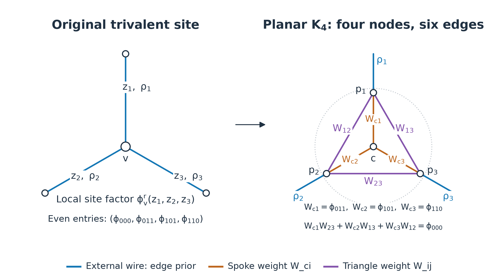
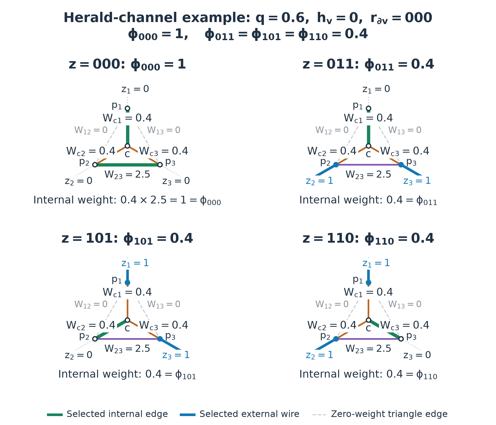
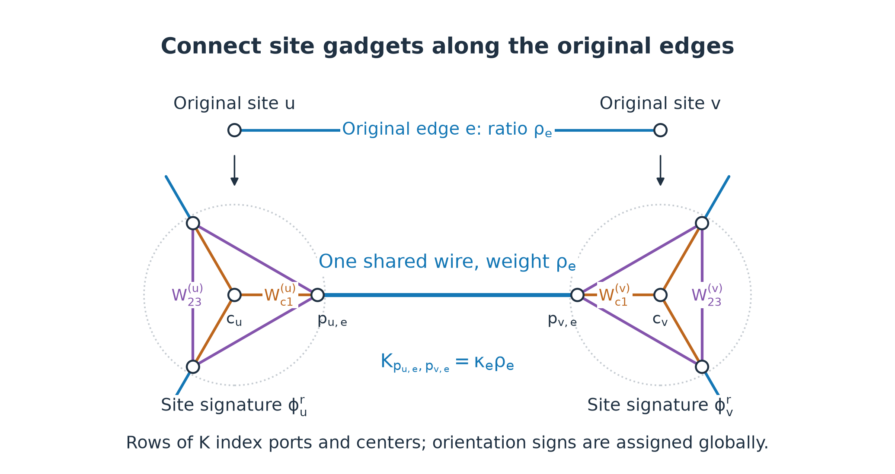
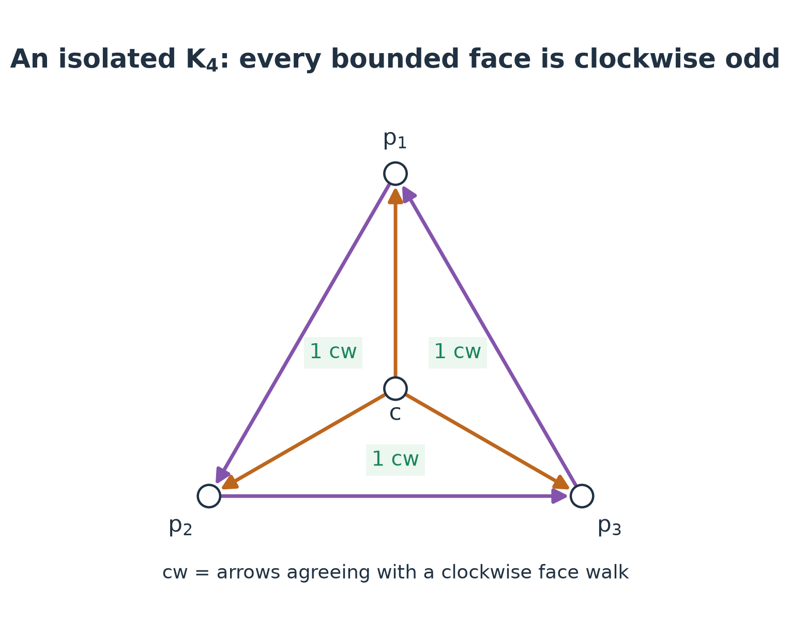

# Planar logical ML with matchgates and a Pfaffian observable

## Summary

The Pfaffian acts on an expanded auxiliary matching graph: original edge weights become wire weights connecting gadgets, while original vertex weights become internal gadget-edge weights. The matrix $K$ contains both kinds of information. Planarity alone is insufficient; local matchgate conditions are also required. Exact parity and degree at most three ensure these conditions in Lab 009.

## Evidence

The [general validation](../results/validation.json) and [generic-factor check](../results/planar-factor-contract-validation.json) exercise the implementation within their stated finite-size scopes. The [site-to-Pfaffian check](../results/site-gadget-partition-review.json) additionally checks absolute partition sums and matching observables.

The [diagram receipt](../results/k4-gadget-diagrams.json) checks that every illustrated matching covers each auxiliary node exactly once and reproduces the numerical site's four even entries. It also enumerates all eight port patterns for 12 choices from the solution family, including zero coefficients and nonzero free triangle edges. The orientation example checks the production face algorithm, including an odd-size graph and repeated bridge occurrences. The four schematics below are available as PNG, SVG and PDF.

## Status

Current with explicit geometry and floating-point limits; no all-size numerical certificate is asserted.

## Related pages

- [[statistical-mechanics|Sector partition functions]]
- [[transfer-mps|Independent contractions]]

## The original edge-spin partition function

Let the original graph be $G=(V,E)$, with a binary variable $x_e\in\{0,1\}$ on each edge. Throughout this page, **$w_e$ denotes an original edge weight, $\phi_v$ a site function, and $W$ an auxiliary matching-edge weight**. A site function depends on several incident edge variables; it introduces neither an independent vertex spin nor a configuration-independent constant.

| Symbol | Meaning |
| --- | --- |
| $w_e(x_e)$ | Original physical edge Boltzmann weight |
| $\phi_v(x_{\partial v})$ | Original physical site Boltzmann weight |
| $\phi_v^r(z_{\partial v})$ | The same site function evaluated at $x=r\oplus z$ |
| $\rho_e=w_e(1-r_e)/w_e(r_e)$ | Ratio derived from the original edge weight; an occupied relative wire carries this ratio |
| $W_{ci}=W_{c,p_i}$ | Auxiliary spoke weight inside one gadget |
| $W_{ij}=W_{p_i,p_j}$ (within one gadget) | Auxiliary triangle-edge weight; globally $W_{ab}$ denotes any auxiliary edge |
| $K_{ij}=\kappa_{ij}W_{ij}$ | The oriented, antisymmetric matrix entry |

Thus $\rho_e$ is a derived ratio, and $W$ belongs to the expanded graph. Neither is an additional physical likelihood. All internal gadget edges are labeled by their auxiliary weights: $W_{ci}$ for spokes and $W_{ij}$ for triangle edges. The equalities below relate these weights to the physical site entries $\phi_\beta$; the symbols serve different roles.

Given the exact syndrome $s$, the original discrete partition function is

$$
Z(s)=\sum_{x\in\{0,1\}^{E}}1\{Hx=s\}
\prod_e w_e(x_e)\prod_{v\in D}\phi_v(x_{\partial v}).
$$

In this project, $w_e(0)=1-p$, $w_e(1)=p$, and $\phi_v(x_{\partial v})=\phi_q(h_v,\sum_{e\ni v}x_e)$. Interpreting $-\log w_e$ and $-\log \phi_v$ as energies with inverse temperature absorbed gives the statistical-mechanics formulation. Logical ML additionally imposes $\ell(x)=a$ to compute $Z_0$ and $Z_1$ separately.

For a general model, this sum can be evaluated by enumeration, variable elimination, or tensor-network contraction. **Planarity of the original graph alone does not turn the partition function of arbitrary vertex interactions into a Pfaffian.** The additional structure used here is explained below.

## First use parity, then change variables

Choose a reference $r$ using only the visible record, with $Hr=s$, and write $x=r\oplus z$. Then $Hz=0$: the incident $z$ bits have even parity at every measured vertex. Assuming $w_e(r_e)>0$ for the ratios below, define

$$
C_0=\prod_e w_e(r_e),\quad
\rho_e=\frac{w_e(1-r_e)}{w_e(r_e)},\quad
\phi_v^r(z_{\partial v})=\phi_v(r_{\partial v}\oplus z_{\partial v}).
$$

Then

$$
Z(s)=C_0\sum_{z:Hz=0}\prod_e \rho_e^{z_e}\prod_{v\in D}\phi_v^r(z_{\partial v}).
$$

The Bernoulli prior gives $\rho_e=(p/(1-p))^{1-2r_e}$. This change of variables retains the site function. For one degree-three site, abbreviate $\phi_\beta:=\phi_v^r(\beta)$, suppressing only the fixed site and reference labels. The four allowed entries are

$$
(\phi_{000},\phi_{011},\phi_{101},\phi_{110}).
$$

Deterministic priors and hard zeros require support restrictions or dedicated branches; division by zero is invalid.

## Assumptions and local signature

The model has a planar embedding, binary edge variables, exact parity, and measured sites of degree two or three. For a tensor with at most three legs, fixed even or odd parity suffices for the matchgate conditions. The reference transformation puts our tensors in the even-parity form.

At four legs, parity must be supplemented by identities such as

$$
\phi_{0000}\phi_{1111}-\phi_{1100}\phi_{0011}
+\phi_{1010}\phi_{0101}-\phi_{1001}\phi_{0110}=0.
$$

General degree-four site factors do not satisfy this identity. This is why the current source solver does not claim square-lattice planar ML. **Planarity handles global pairing signs; matchgate identities ensure that each local site tensor can be represented by a matching gadget.**

[Cai and Gorenstein, Matchgates Revisited](https://www.theoryofcomputing.org/articles/v010a007/v010a007.pdf), Section 2, equations (2.1)–(2.2), define the weighted perfect-matching sum and the signature obtained by removing selected external nodes. The edge-only weights in that definition belong to the auxiliary matchgate graph. Applying it to this model requires the site-function-to-signature conversion below; the original graph's edge priors alone do not define the complete matching model.

## Constructive gadget and weights

Place three ports $p_1,p_2,p_3$ around the original vertex in cyclic order, and add a center $c$. The ports form a triangle, and the center connects to all three ports. The four nodes are $\{c,p_1,p_2,p_3\}$ and the six internal edges are

$$
\{cp_1,cp_2,cp_3,p_1p_2,p_1p_3,p_2p_3\}.
$$

**This is $K_4$: the complete graph on four vertices.** Every pair of nodes has an edge, and each node has internal degree three. Drawing one node inside the triangle formed by the other three gives a planar embedding without crossings. The external wires are attached to the three ports and are not part of the internal $K_4$. This gadget fits inside a small disk around the original site.

*Construction and weights.* This first diagram is symbolic; it does not assign numerical site weights. Blue wires retain the original edge-prior ratios $\rho_i$. Orange spokes $W_{c1},W_{c2},W_{c3}$ and purple triangle edges $W_{12},W_{13},W_{23}$ encode the site function $\phi_v^r$. All six internal $K_4$ edges are drawn. The dotted disk marks the local replacement region. Here $W_{ij}$ on a triangle edge abbreviates $W_{p_i,p_j}$ within this one gadget. These are undirected schematics; Kasteleyn signs are assigned to the complete expanded graph later. [SVG](../figures/k4-gadget-construction.svg) · [PDF](../figures/k4-gadget-construction.pdf).

Let $z_i=1$ mean that the perfect matching uses external wire $i$. That wire has already covered $p_i$, so the internal matching must not cover it again. Removing an external node in the literature is the equivalent operation for computing a local signature; the node remains present in the global graph.

For this local calculation, write $W_{ci}:=W_{c,p_i}$ and $W_{ij}:=W_{p_i,p_j}$ for the same auxiliary-edge weights used in $K$. Enumerating the possible internal matchings gives

| Relative bits | Remaining internal nodes | Internal matching weight |
| --- | --- | --- |
| $000$ | $p_1,p_2,p_3,c$ | $W_{c1}W_{23}+W_{c2}W_{13}+W_{c3}W_{12}$ |
| $011$ | $p_1,c$ | $W_{c1}$ |
| $101$ | $p_2,c$ | $W_{c2}$ |
| $110$ | $p_3,c$ | $W_{c3}$ |
| odd parity | An odd number of remaining nodes | $0$ |

The last three even patterns therefore **fix** the spoke weights:

$$
W_{c1}=\phi_{011},\qquad W_{c2}=\phi_{101},\qquad W_{c3}=\phi_{110}.
$$

The remaining condition on the three triangle weights is

$$
\phi_{011}W_{23}+\phi_{101}W_{13}+\phi_{110}W_{12}=\phi_{000}.
$$

**The $\phi$ entries are inputs, not adjustable gadget parameters.** First evaluate the observed site's physical function at $r\oplus000$, $r\oplus011$, $r\oplus101$, and $r\oplus110$. This supplies the four $\phi$ values. Then choose triangle weights $W$ satisfying the displayed equation. Different choices of $W$ can represent exactly the same site function.

For the project's herald channel, this evaluation is explicit. With $n_\beta=\sum_{i=1}^3(r_i\oplus\beta_i)$,

$$
\phi_\beta=
\begin{cases}
q\,1\{n_\beta\ge2\},&h_v=1,\\
1-q\,1\{n_\beta\ge2\},&h_v=0.
\end{cases}
$$

For $r_{\partial v}=000$ and $h_v=0$, these expressions give $\phi_{000}=1$ and $\phi_{011}=\phi_{101}=\phi_{110}=1-q$. The four-panel example below uses $q=0.6$. No likelihood is fitted or selected by the gadget construction.

### Existence and the full nonnegative solution family

Assume finite, nonnegative physical weights. **A solution exists whenever at least one of $\phi_{011},\phi_{101},\phi_{110}$ is positive.** For example, if $\phi_{011}>0$, the choice $(W_{23},W_{13},W_{12})=(\phi_{000}/\phi_{011},0,0)$ already proves existence.

When all three coefficients are positive, the complete nonnegative solution family is

$$
(W_{23},W_{13},W_{12})=
\phi_{000}\left(\frac{\alpha_1}{\phi_{011}},
\frac{\alpha_2}{\phi_{101}},\frac{\alpha_3}{\phi_{110}}\right),
\qquad \alpha_i\ge0,\quad \alpha_1+\alpha_2+\alpha_3=1.
$$

For $\phi_{000}>0$, this is exhaustive: any solution defines $\alpha_1=\phi_{011}W_{23}/\phi_{000}$, $\alpha_2=\phi_{101}W_{13}/\phi_{000}$, and $\alpha_3=\phi_{110}W_{12}/\phi_{000}$. These parameters allocate the total $\phi_{000}$ among the three possible internal matchings. The solution set is a triangle with vertices

$$
(W_{23},W_{13},W_{12})=
(\phi_{000}/\phi_{011},0,0),\quad
(0,\phi_{000}/\phi_{101},0),\quad
(0,0,\phi_{000}/\phi_{110}).
$$

If one or two coefficients vanish, keep the same formula only for the positive coefficients and require the corresponding $\alpha$ values to sum to one. For instance, when $\phi_{011}=0$, set $\alpha_1=0$, **do not evaluate the first quotient**, and let $W_{23}$ be any nonnegative number; apply the analogous rule to the other two coefficients. A zero coefficient makes its opposite triangle edge irrelevant to every local signature entry. Setting such free edges to zero is the simplest choice. This gives the full family with zero coefficients as well.

If $\phi_{000}=0$ and at least one coefficient is positive, every triangle edge opposite a positive coefficient must have weight zero. Edges opposite zero coefficients remain arbitrary and nonnegative. The formula above yields these solutions, although its $\alpha$ values are then redundant.

If all three coefficients vanish, the equation reduces to $0=\phi_{000}$. When $\phi_{000}=0$, every signature entry vanishes and there is no supported local configuration. When $\phi_{000}>0$, **this four-node $K_4$ construction has no solution**: all spokes are forced to zero, so no internal perfect matching can have positive weight. A larger local gadget or the forced-wire construction below handles that case. Parity suffices for some matchgate representation at arity three; it does not guarantee that this particular four-node template works in every zero-support case.

The simplest implementation choice, when $\phi_{011}>0$, is the first vertex of the solution triangle: set $W_{23}=\phi_{000}/\phi_{011}$ and $W_{13}=W_{12}=0$. Otherwise choose a different positive coefficient. Zero edge weights specialize the $K_4$ template; the subgraph of positive-weight edges need not itself be complete.

### Herald-channel example in site-function notation

The [four-panel figure below](../figures/k4-gadget-matchings.png) uses the physical herald record $q=0.6$, $h_v=0$, $r_{\partial v}=000$. Its site entries are $(\phi_{000},\phi_{011},\phi_{101},\phi_{110})=(1,0.4,0.4,0.4)$. Choose the pivot $\phi_{011}>0$, giving three spoke weights of $0.4$ and triangle weights $(W_{23},W_{13},W_{12})=(2.5,0,0)$. The internal matching for $000$ has weight $0.4\times2.5=1=\phi_{000}$; the other even patterns each leave a single spoke of weight $0.4$. Each panel labels its site entry as $\phi_{xxx}$ together with its physical value, and each internal edge by its $W$ symbol and numerical weight.

*Four local matching cases.* Each panel states its site entry: $\phi_{000}=1$, $\phi_{011}=\phi_{101}=\phi_{110}=0.4$. Internal edges retain the labels $W_{ci}$ or $W_{ij}$, including zero weights. Green edges are the selected internal matching; solid blue wires cover the blue ports externally, giving $z_i=1$. Every port and the center is covered exactly once. Dashed triangle edges have zero weight for this pivot choice; dotted external wires are unoccupied. The triangle weight $2.5$ is an auxiliary ratio $\phi_{000}/\phi_{011}$; its product with the spoke weight $0.4$ gives the likelihood $1$. The displayed products are **site weights only**: occupied external wires contribute their $\rho_i$ separately in the global matching sum. Odd relative parity leaves an odd number of internal nodes and contributes zero. [SVG](../figures/k4-gadget-matchings.svg) · [PDF](../figures/k4-gadget-matchings.pdf).

### Zero-support branches and normalization

If only $\phi_{000}>0$, a strictly local gadget is still possible: attach one private leaf to each port and give the three internal edges weights $\phi_{000},1,1$. With no external wire occupied, there is a unique matching of weight $\phi_{000}$. Occupying any external wire leaves a private leaf unmatched, so every other signature entry is zero. This six-node gadget is not $K_4$.

To retain a fixed topology, the current implementation uses an equivalent global construction: forbid occupancy of all relative wires incident to that site, use an internal gadget with total matching weight one, and retain $\phi_{000}$ in the overall constant. Here the site's hard constraint also enters the external wires through zero weights. Ratios with zero denominators are invalid. If all allowed entries vanish, the site has no local support.

A degree-two site allows only $00,11$. One internal port-to-port edge of weight $\phi_{00}/\phi_{11}$ produces the signature $(\phi_{00}/\phi_{11},1)$; restoring the original weight requires multiplication by $\phi_{11}$. If $\phi_{11}=0$, use the branch that forces the wires to be unoccupied.

The implementation divides degree-three signatures by their maximum entry to improve numerical scaling. Write the normalized signature as $\widehat \phi_v=\phi_v^r/\lambda_v$. With a forced-wire branch, $\widehat \phi_v$ denotes the effective signature of the gadget together with its wire-support restrictions. The constant $\lambda_v$ is independent of the configuration and cancels from logical probabilities; it must be restored when computing the **absolute partition function**. The diagrams use unnormalized weights so that their local products equal the physical $\phi$ entries directly.

## Exactly what the matrix K contains

Replace each vertex by its gadget, then connect the corresponding ports along the original edges to obtain the expanded graph $\widetilde G$. Original edge $e=uv$ becomes wire $p_{u,e}p_{v,e}$ with weight $W_{p_{u,e},p_{v,e}}=\rho_e$. The wire contributes the prior ratio once; the two endpoint gadgets contribute their respective site factors.

*Gluing gadgets into the matrix graph.* The original edge becomes one blue wire between two auxiliary ports, with weight $\rho_e$ counted once. Each endpoint's site function remains in that endpoint's orange and purple internal edges. All these edges enter $K$ with their globally assigned orientation signs, and their reverse entries have opposite signs. The other blue wires continue to neighboring gadgets outside the schematic. [SVG](../figures/k4-gadget-gluing.svg) · [PDF](../figures/k4-gadget-gluing.pdf).

The matrix $K$ is the signed, antisymmetric adjacency matrix of $\widetilde G$. Its indices $i,j$ label **auxiliary matching nodes**, including ports, centers, and boundary-rail nodes. They do not label the original bits $x_e$ or just the original vertices.

$$
K_{ij}=
\begin{cases}
\kappa_{ij}W_{ij},&ij\in E(\widetilde G),\\
0,&\text{otherwise},
\end{cases}
\qquad K_{ji}=-K_{ij}.
$$

Here $\kappa_{ij}=\pm1$ comes from a Kasteleyn orientation of the entire expanded graph:

| Auxiliary edge | Source of its weight |
| --- | --- |
| External wire corresponding to an original edge | Original edge prior ratio $\rho_e$; a forced-wire branch may also set it to zero |
| Spokes $cp_1,cp_2,cp_3$ | Site entries $\phi_{011},\phi_{101},\phi_{110}$, or their normalized values |
| Triangle edges $p_1p_2,p_1p_3,p_2p_3$ | Any nonnegative solution $W$ of the local matching equation above |
| Boundary-rail wires and gadgets | Unit weights encoding boundary parity |

For the displayed pivot, $K$ contains spoke entries with magnitudes $\phi_{011},\phi_{101},\phi_{110}$ and a triangle entry with magnitude $\phi_{000}/\phi_{011}$. **These entries are where the vertex weight enters the matrix.** Filling only the original graph's adjacency matrix with edge priors would omit the site likelihood.

In the source code, <code>ParityGadgets.sites</code> identifies each site's spoke and triangle edges, and <code>posterior_from_factors</code> fills their weights using the normalized entries of $\phi_v^r$. It chooses the first positive spoke coefficient and puts the entire $\phi_{000}$ contribution on the opposite triangle edge. The array <code>gadgets.wire</code> receives $\rho_e$. All auxiliary edges then receive orientation signs before the sparse matrix $K$ is constructed. The production API remains restricted to the canonical honeycomb geometry; this mathematical explanation does not extend the API to arbitrary planar graphs.

## Assigning a Kasteleyn orientation

### The face rule and the signs in K

Fix a planar embedding of the **complete expanded graph** $\widetilde G$, including gadget edges, connecting wires and the boundary rail. Orient each edge so that every bounded face has an **odd number of clockwise arrows**:

$$
n_{\rm cw}(F)\equiv1\pmod2.
$$

Walk around a bounded face clockwise, keeping the face on your right; count arrows agreeing with that walk. A triangle may have one or three such arrows. A square may also have one or three. Count boundary **occurrences**: a bridge is traversed twice in opposite directions and contributes one agreeing occurrence. Bipartiteness and even face length are unnecessary. This is the plane-graph rule in [Galluccio and Loebl, Theorem 1.7](https://www.combinatorics.org/ojs/index.php/eljc/article/download/v6i1r6/pdf).

With the convention used here,

$$
K_{ij}=\begin{cases}+W_{ij},&i\longrightarrow j,\\-W_{ij},&j\longrightarrow i,\end{cases}
\qquad K_{ji}=-K_{ij}.
$$

An arrow specifies a matrix sign, independently of the physical weights. Orienting isolated gadgets separately does not enforce the rule on faces formed between gadgets.

### A constructive assignment procedure

1. Enumerate the faces of the fixed embedding.
2. Construct the dual graph: a dual vertex represents a face; a dual edge crosses a primal edge separating two faces. Ignore dual loops from bridges.
3. Choose a dual spanning tree rooted at the outer face. Orient primal edges outside this tree arbitrarily.
4. Process bounded faces from the tree's leaves toward its root. Each face has one remaining unassigned edge, crossing its parent edge. Direct it to make that face's clockwise count odd.
5. Check every bounded face. The outer face needs no separate assignment.

This construction is described in [Cimasoni, The geometry of dimer models, Section 3](https://www.unige.ch/~cimasoni/Berlin.pdf). The repository's <code>pfaffian_orientation</code> in [<code>_planar.py</code>](../../../src/herald_decoder/_planar.py) implements it. Its face walks are counterclockwise for bounded faces, so it counts arrows opposing those walks. Once face boundaries are available, the tree construction and assignment take $O(|\widetilde V|+|\widetilde E|)$ operations; extracting them from coordinates additionally sorts the incident rays.

### When is assignment possible?

**Every finite connected plane graph admits the bounded-face rule.** Disconnected graphs can be handled component by component. An even number of vertices is unnecessary for assigning these arrows; a perfect matching, however, requires an even number in each component. Even size alone does not ensure a matching or a positive partition sum.

For a connected graph with $V$ vertices, $E$ edges and $F$ faces including the outer face, the outer parity is forced. Count agreeing arrows using face-on-the-right boundary walks, also for the outer face. Each edge contributes once across its two face occurrences, and Euler's relation gives

$$
n_{\rm cw}(F_{\rm outer})\equiv E-(F-1)\equiv V-1\pmod2.
$$

Thus imposing the odd rule on **all** faces is possible exactly when $V$ is even. For the outer face, a face-on-the-right walk runs geometrically counterclockwise around the enclosed graph; confusing this convention with the bounded-face walk reverses the interpretation. The production helper requires a connected planar embedding; component handling is a mathematical extension, not an additional API claim.

### An explicit K4 example

*One valid orientation of an isolated gadget.* Direct the outer triangle $p_1\to p_2\to p_3\to p_1$, and all spokes $c\to p_i$. Each bounded triangle has exactly one clockwise arrow, marked in the figure. The arrows remain valid when some weights are zero. This demonstrates the local rule; the glued decoder graph is oriented globally by the dual-tree procedure. [SVG](../figures/k4-gadget-orientation.svg) · [PDF](../figures/k4-gadget-orientation.pdf).

For node order $(p_1,p_2,p_3,c)$, this example gives

$$
K_{\rm iso}=\begin{pmatrix}
0&W_{12}&-W_{13}&-W_{c1}\\
-W_{12}&0&W_{23}&-W_{c2}\\
W_{13}&-W_{23}&0&-W_{c3}\\
W_{c1}&W_{c2}&W_{c3}&0
\end{pmatrix},
$$

$$
\operatorname{Pf}K_{\rm iso}
=-W_{12}W_{c3}-W_{13}W_{c2}-W_{c1}W_{23}
=-\phi_{000}.
$$

All three internal matching terms have the same sign. The global minus sign is harmless: its absolute value is the no-external-occupation site weight.

### Why the face rule suffices, and where it stops

Two perfect matchings differ along disjoint even alternating cycles. Summing the face rule inside a simple cycle $C$, then using Euler's relation for its disk, yields

$$
n_{\rm cw}(C)\equiv1+V_{\rm int}(C)\pmod2.
$$

For an alternating cycle, interior vertices match among themselves, so $V_{\rm int}(C)$ is even. Changing the matching along $C$ therefore changes its Pfaffian coefficient by $(-1)^{n_{\rm cw}(C)+1}=+1$. This is why all matching terms share one sign; see the proof accompanying [Galluccio and Loebl, Theorem 1.7](https://www.combinatorics.org/ojs/index.php/eljc/article/download/v6i1r6/pdf).

Planarity is sufficient, but some nonplanar graphs also admit a Pfaffian orientation. The general criterion requires every even cycle whose vertex deletion leaves a perfectly matchable graph to be oddly oriented. Other nonplanar graphs, including $K_{3,3}$, fail this criterion. On a torus, face checks leave noncontractible cycles uncontrolled; the general dimer formula uses four Pfaffians, or $4^g$ for genus $g$. See [Cimasoni, Sections 2–3](https://www.unige.ch/~cimasoni/Berlin.pdf). These global orientation conditions are separate from the local site-tensor matchgate conditions above.

## Why the entire partition sum is a Pfaffian

For fixed external wire bits $z$, the internal matchings of each gadget can be summed independently, producing $\prod_v\widehat \phi_v(z_{\partial v})$. Summing over all wire choices then gives

$$
Z_{\rm dimer}
=\sum_{M\ {\rm perfect\ matching\ of}\ \widetilde G}
\prod_{ij\in M}W_{ij}
=\sum_{z:Hz=0}\prod_e \rho_e^{z_e}\prod_v\widehat \phi_v(z_{\partial v}).
$$

Rough boundaries require the parity rail described below. Its weights are one, so it introduces no additional physical likelihood. Hence

$$
Z(s)=C_0\Bigl(\prod_{v\in D}\lambda_v\Bigr)Z_{\rm dimer}.
$$

If $K$ has $2N$ auxiliary nodes, $\operatorname{Pf}K$ expands over all pairings of those nodes. A pairing with no corresponding auxiliary edge has zero weight; the remaining terms correspond to perfect matchings. The expansion carries permutation signs, but a Kasteleyn orientation makes the total sign of every valid matching term the same. Therefore

$$
Z_{\rm dimer}=|\operatorname{Pf}K|,\qquad
Z(s)=C_0\Bigl(\prod_v\lambda_v\Bigr)|\operatorname{Pf}K|.
$$

For example, for a four-dimensional antisymmetric matrix,

$$
\operatorname{Pf}K=K_{12}K_{34}-K_{13}K_{24}+K_{14}K_{23}.
$$

The minus sign in the middle term shows why the orientation must be globally consistent: pairing signs cannot be ignored after assigning positive weights. The identity $\det K=(\operatorname{Pf}K)^2$ holds, but the determinant itself is not the partition function.

## The Grassmann path-integral interpretation

If path integral means a fermionic Gaussian integral, the same $K$ gives an exact algebraic identity. Introduce one Grassmann variable $\psi_i$ per auxiliary node, with $\psi_i\psi_j=-\psi_j\psi_i$ and $\psi_i^2=0$. Choose the integration convention $\int d\psi_{2N}\cdots d\psi_1\,\psi_1\cdots\psi_{2N}=1$. Then

$$
\operatorname{Pf}K=
\int d\psi_{2N}\cdots d\psi_1\,
\exp\left(\frac12\psi^TK\psi\right).
$$

The exponent $\frac12\psi^TK\psi=\sum_{i<j}K_{ij}\psi_i\psi_j$ contains only quadratic terms. After expansion, integration retains only terms in which every $\psi_i$ appears exactly once: the perfect matchings. Exchanging Grassmann variables produces the Pfaffian's pairing signs.

The variables $\psi_i$ are auxiliary computational variables; the original classical bits $x_e$ remain discrete, and no physical fermions are assumed. The correspondence is **original discrete sum → matching-gadget conversion preserving weights → Gaussian Grassmann integral/Pfaffian**.

The free-fermion structure of a degree-three parity tensor is also visible locally:

$$
\mathcal F_v(\theta)
=\phi_{000}+\phi_{110}\theta_1\theta_2+\phi_{101}\theta_1\theta_3+\phi_{011}\theta_2\theta_3.
$$

When $\phi_{000}\ne0$,

$$
\mathcal F_v(\theta)=\phi_{000}\exp\left(
\frac{\phi_{110}}{\phi_{000}}\theta_1\theta_2+
\frac{\phi_{101}}{\phi_{000}}\theta_1\theta_3+
\frac{\phi_{011}}{\phi_{000}}\theta_2\theta_3
\right).
$$

With three Grassmann variables, the product of any two quadratic terms repeats a variable, so all higher-order terms vanish. Thus any four even weights admit this local Gaussian expression. At four legs, the quadratic exponential produces a quartic term whose coefficient must obey the matchgate identity above. A general site interaction need not satisfy it and therefore does not automatically admit this Gaussian/Pfaffian algorithm.

Direct contraction of site Grassmann functions also requires consistent leg ordering and edge-contraction signs. The local three-dimensional matrix above cannot simply serve as the global $K$; the implementation uses explicit gadgets and a global orientation to carry out these steps. When $\phi_{000}=0$, the expression containing $1/\phi_{000}$ is invalid; use a suitable gadget, pivot, or limiting construction.

[Bravyi, Contraction of matchgate tensor networks](https://arxiv.org/abs/0801.2989), Sections 2.3, 3.3, and 4, develops Grassmann Gaussian integrals, Gaussian generating functions for matchgates, and contraction theory. This connects vertex-tensor models to edge-weight matching models.

## Rough-boundary rail and sector encoding

Join the active rough terminals by a planar rail outside the patch, ordered up the left side and down the right side, with a top bridge. Add parity gadgets at rail vertices. For each even relative subgraph, the rail bits are determined by cumulative terminal parity; occupancy of the top bridge is its right-boundary parity. The package cut differs from that boundary cut by a syndrome-dependent offset. Since $z$ has zero syndrome, their parities agree on $z$. Finally translate from relative sector to absolute sector by $\ell(x)=\ell(z)\oplus\ell(r)$. This avoids discarding same-side boundary paths or confusing cuts on nonzero syndrome configurations.

## Logical probabilities from one inverse element

For the logical rail edge $(i,j)$ of the expanded graph, let $P_b$ be its probability of occupancy in a matching:

$$
P_b=W_{ij}
\frac{\partial\log Z_{\rm dimer}}{\partial W_{ij}}
=K_{ij}(K^{-1})_{ji}.
$$

The derivation uses $d\log\operatorname{Pf}K=\frac12\operatorname{Tr}(K^{-1}dK)$. Changing one edge changes both $K_{ij}$ and $K_{ji}$, so the final expression has no additional factor of $1/2$. The overall orientation-dependent Pfaffian sign is constant and does not affect this derivative.

Occupancy of the top rail bridge is the relative logical sector:

$$
Z^{\rm relative}_1=Z_{\rm dimer}P_b,\qquad
Z^{\rm relative}_0=Z_{\rm dimer}(1-P_b).
$$

To recover the physical $Z_a$, multiply by the common factor $C_0\prod_v\lambda_v$ and translate the sector label using $\ell(r)$. In the posterior $P_a=Z_a/(Z_0+Z_1)$, the overall constant and total partition function cancel.

The implementation therefore needs only one sparse LU factorization and one solve $Kz=e_i$, without explicitly computing a numerical Pfaffian or the absolute $Z$. **The Pfaffian supplies the partition-function identity; the inverse entry supplies the logical probability needed for decoding.** They describe the same model. If $\ell(r)=1$, reverse the absolute-sector probabilities.

## A small check of the weight-preserving conversion

The [explanatory check](../results/site-gadget-partition-review.json) enumerates all eight local port patterns for four nonnegative test signatures, including zero entries and the private-leaf construction when only $\phi_{000}$ is positive. Eight closed planar four-vertex fixtures then compare all $2^6$ physical configurations, auxiliary perfect matchings, a recursive Pfaffian and an inverse-entry occupancy.

They check the absolute identity $Z=C_0|\operatorname{Pf}K|$ without dropping site factors or normalizing away a missing constant. Maximum relative partition error and absolute occupancy error are both $2.22\times10^{-16}$. This illustrates the reduction; it does not extend production geometry support or certify large-matrix numerical stability. Reproduce with <code>scripts/validate_site_gadget_partition.py</code>.

## Numerical gates and integration

`HeraldPlanarMLDecoder` builds the literal binary-herald factors and uses visible-record configuration MAP as a reference to improve conditioning. `PlanarParitySolver.posterior_from_factors` accepts other nonnegative binary local factors in `graph.incident_edges` order. No sampled truth is used. Positive diagonal congruence $K\mapsto D K D$ balances dynamic range and leaves edge occupancies invariant. It multiplies the dimer partition function by $\prod_i D_{ii}$ because every auxiliary node occurs once in each perfect matching; an absolute physical partition sum must undo this additional scale. The implementation checks solve residual, finiteness and probability range. Algebraic exactness is not an all-size floating-point guarantee.

For the herald wrapper, $0<p<10^{-12}$ or $1-10^{-12}<p<1$ uses exact transfer under its width/memory caps; it raises if that fallback cannot run. The generic factor solver does not offer that specialized fallback. A numerical failure is explicit, never silently converted to a class decision. Batch planar decoding currently loops over shots. The reusable geometry and sparse topology are constructed once; no dense inverse is stored.

The primary gain over BP is full correlated sector summation. The limitations are supported geometry, local-factor assumptions and numerical conditioning. [Transfer/MPS](transfer-mps.md) supplies an independent formulation and a route beyond matchgate signatures. The [general validation](../results/validation.json) and [supplemental factor-contract validation](../results/planar-factor-contract-validation.json) record the tested range: the latter compares 12 L=2 random positive-factor records against whole-error enumeration, switches between both logical reference sectors, permutes the edge ordering, and rejects negative/nonfinite factors. Its maximum posterior error is 3.33e-16 at p=.23; it does not certify larger-size conditioning or arbitrary geometry. [Source](../../../src/herald_decoder/planar_ml.py).

## Full-prior update

The domain is p in [0,1]. Deterministic p=1 records are supported and impossible records rejected. The herald planar/MPS wrappers also use the width-capped exact transfer fallback when 1−10^{-12}<p<1. Literal transfer priors are (1−p,p); no complement folding is used.
