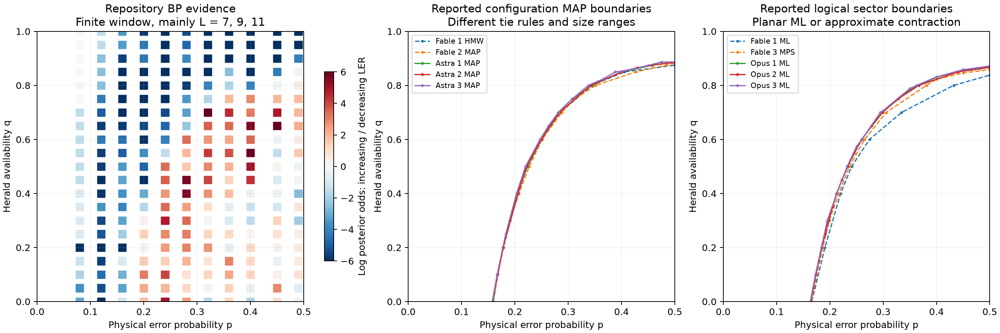

# SciCode2 assessment of nine agent submissions

## Summary

This page brings the original independent nine-run assessment into Lab 009, including individual results, defects, the repository comparison and lessons for task difficulty. All nine produced substantive research; at least six had strongly supported completion. This pilot does not support a frontier success target below 10% or a 10–20-hour active-work requirement.

## Status

The runs answered the original restricted task, p≤1/2. Evaluate them against that supplied scope. The present binary-herald research domain is p,q in [0,1]; the historical comparison figure does not claim full-domain coverage. Elapsed time includes computation and is not active scientific time. The audit is independent assessment, not pipeline correctness grading. Submitted reports are source material; their claims are reviewed rather than automatically endorsed.

## Evidence

[Exact original audit snapshot](../data/inherited/audit_REPORT.md), [trial metadata](../data/inherited/audit_run_inventory.json), [provenance](../results/run-evaluation-integration.json) and the original comparison figure below. The nine submitted text reports are archived with source hashes so their links work inside the repository. New Lab 009 implementation results remain a separate evidence cohort.

## Related pages

- [[index|Lab 009 survey]]
- [[comparison|Integrated decoder comparison]]
- [[model|Current model and full physical domain]]

## Independent assessment


The nine submitted runs show substantially more success than the intended difficulty target of this problem. All nine reconstructed the specified lattice and developed substantive decoders, numerical campaigns, and two-dimensional diagrams. The strongest submissions go beyond our Lab 003 evidence by computing logical-sector posteriors with planar matching gadgets and by studying much larger lattices. They deserve credit for those improvements, even when their boundaries differ from our figure.

This is an independent scientific audit, not the original pipeline's grading result. The supplied manifest explicitly says that the runs were ungraded and that reward and subscores measure file production only. The assessment below combines source and data inspection, independent exact enumeration, and a fresh comparison with the repository decoder. It does not certify every asymptotic claim or rerun all production campaigns.

## Comparison with the repository

The common experiment is iid retained-edge errors, exact detector syndrome, and conditionally independent binary heralds with no false positives. The logical loss is syndrome validity plus residual right-boundary parity. A correction need not reconstruct the sampled errors or itself reproduce the herald record. All comparisons must respect these definitions.

The repository reference uses BP followed by matching with posterior log-likelihood-ratio weights. The accepted [Lab 003 report](../../lab-003-herald-threshold-phase-diagram/REPORT.md) calls its result a **finite-window directional map**, primarily using L=7,9,11, rather than an established thermodynamic threshold. Our own current evidence therefore cannot be treated as the exact answer key for a larger-size phase diagram.

The historical B18 visual guide imposed p versus 1−p symmetry. That assumption is false for incomplete binary heralds at intermediate q, and B18 has since been withdrawn. Its shape is not an acceptance gate. The comparison below uses the measured B14 trend evidence, not that guide.



**Figure 1.** Left: the repository's 231 finite-window trend cells; blue means evidence for decreasing LER over the measured sizes, and red means increasing LER. A decreasing trend is not a proof of decodability. Middle and right: the submissions' reported boundary estimates, separated by decoder objective. Lines connect estimates and are not new fits. Uncertainty bands are omitted here for legibility; the reports and source tables supply their distinct uncertainty conventions. One Fable run contributes both a MAP and an auxiliary approximate ML curve, giving ten curves for nine runs. No curves are pooled into a reference threshold.

There are two coherent numerical families:

| Quantity | Configuration MAP studies | Large-size planar logical ML studies |
| --- | --- | --- |
| Syndrome-only threshold estimate | about 0.158–0.160 | about 0.163–0.165 |
| Threshold at q=0.5 | about 0.220–0.227 | about 0.233–0.234 |
| Boundary endpoint at p=0.5 | roughly q=0.88–0.89 | roughly q=0.866–0.872 |
| q=1 edge | inferred and analytically justified as decodable | same conclusion |

These ranges describe **reported finite-size estimates**, not joint confidence intervals. The MAP endpoint includes differences in fit choices and tie rules; Fable run 1's central endpoint of 0.875 comes from a visibly inadequate fit and should receive less weight. Its small-size auxiliary ML endpoint is about 0.838, and Fable run 3 estimates about 0.858 using sizes up to 24. Their displacement from the larger Opus studies is a warning about finite-size extrapolation, not evidence that the physical models differ.

MAP maximizes the posterior of one complete error configuration. Logical ML sums posterior weight over every configuration in each logical sector and selects the heavier sector. Logical ML minimizes the stated loss; configuration MAP need not. Our BP decoder also targets information about the posterior rather than exactly solving the configuration MAP objective. Consequently, MAP is not guaranteed to outperform BP, and different valid decoder families need not have the same transition.

## Independent correctness checks

The audit used writable copies of Python sources, without running downloaded campaign scripts or loading supplied pickle caches. Instructions inside the submissions were treated as data. Input hashes, adapters, tests, and numerical receipts are saved alongside this report.

**Geometry.** Every run agrees with an independent integer construction at L=2,3,4: full vertex set including isolated tips, retained edges, detector coordinates, H incidence, and the logical mask. This checks the actual sets and operators rather than just their counts. The independent construction was previously checked against the repository graph generator.

**Exact small-system risks.** For each run, the audit enumerated all 2,048 error vectors and every physically possible observation at L=2 for five parameter pairs. There are 5,629 record and parameter cases per run: 2,304 each at (0.2,0.5) and (0.4,0.9), 64 at (0.5,0), 956 at (0.5,1), and one at (0,0.5). Each record was weighted by the literal joint physical law. Ties were allowed. For a canonical correction, the MAP check asks whether its selected sector contains a maximizing configuration, not whether the correction itself has positive posterior weight.

| Decoder group | Exact LER at L=2, p=0.2, q=0.5 | Exact LER at L=2, p=0.4, q=0.9 |
| --- | ---: | ---: |
| All three Opus logical ML decoders | 0.2317753424 | 0.3352633224 |
| Fable run 3 exact transfer contraction | 0.2317753424 | 0.3352633224 |
| All three Astra MAP decoders | 0.2318602678 | 0.3615857729 |
| Fable runs 1 and 2 MAP formulations | 0.2318602678 | 0.3615857729 |

The logical ML decisions attain the exact Bayes risk on every enumerated record at these parameters. The MAP decisions select sectors containing a maximum-weight configuration. The MAP excess at (0.4,0.9) is about 0.0263 in absolute LER, and is an objective-dependent performance gap rather than an implementation defect.

At (p,q)=(0.5,1), all count-compatible configurations have equal configuration weight, while their sectors can have unequal multiplicities. MAP risks therefore differ with tie handling. The audited MAP risks range from about 0.3467 to 0.3828 for the native tested implementations; the logical ML risk is 0.3359375. Our alternative backend for Fable run 2 gives 0.3921, which is not a measurement of its submitted LEMON tie rule. Requiring every MAP submission to reproduce the optimal logical risk would silently change the task.

**Larger exact checks.** For every run, 15 independent observations at L=3 and eight at L=4 were checked by enumerating the full syndrome coset, respectively 1,024 and 131,072 configurations. All returned corrections were valid. The ML submissions selected optimal sectors on these observations; MAP submissions selected sectors containing MAP configurations. Independently computed posterior probabilities for the three Opus decoders and Fable run 3's exact backend agree within 1.8×10⁻¹³ at the checked sizes. These bounded tests do not establish numerical stability at L=96 or validate an MPS approximation at L=24.

**Reproduced defect.** Fable run 1's documented default HMW decoder fails on the only physically possible p=0 observation. It constructs infinite prior weights and PyMatching raises “maximum absolute edge weight of 16777215 exceeded.” This is an actual API endpoint failure and should lose correctness credit. A separate extreme-prior check at p=10⁻⁸⁰ also shows that its fixed herald penalty can select a configuration violating a positive-herald constraint. That demonstrates that its claim of exact configuration MAP over the whole continuous domain is too strong. Herald support is not itself an output requirement; the p=0 missing correction is the direct task violation. Neither observation invalidates its ordinary-parameter Monte Carlo data by itself.

**Portability qualification.** Fable run 2 needs a Linux LEMON shared library unavailable on this macOS workstation. The audit tested the unchanged integer gadget formulation with NetworkX's blossom backend. The geometry and mathematical formulation pass, but the original native backend, native tie rule, and published timing have not been independently rerun here.

## Fresh comparison with our decoder

We generated common errors and herald coins, relabelled them by coordinates, and gave only the allowed observations to current repository residual-priority BP with an 80-iteration cap, Astra run 3 MAP, and Opus run 3 logical ML. Each cell has 500 trials; all exceptions or invalid corrections count as failures. There were none in the completed comparison. Nonconverged BP trials were retained.

| L | p | q | Repository BP failures | Astra MAP failures | Opus ML failures |
| ---: | ---: | ---: | ---: | ---: | ---: |
| 7 | 0.16 | 0 | 100 | 106 | 98 |
| 11 | 0.16 | 0 | 108 | 106 | 92 |
| 7 | 0.24 | 0.5 | 120 | 126 | 136 |
| 11 | 0.24 | 0.5 | 133 | 142 | 109 |
| 7 | 0.40 | 0.8 | 140 | 154 | 124 |
| 11 | 0.40 | 0.8 | 144 | 145 | 116 |
| 7 | 0.49 | 1 | 20 | 25 | 14 |
| 11 | 0.49 | 1 | 2 | 5 | 2 |

At L=11, Opus ML reduces observed failure by 4.8 percentage points at (0.24,0.5) and by 5.6 points at (0.40,0.8), with paired standard errors of about 1.59 and 1.68 points. These are encouraging local differences, not a simultaneous-domain performance guarantee. At L=7, the first of those cells happens to favor BP in the finite sample. Exact ML minimizes expected risk; it does not have to win every realized sample. The MAP comparison does not show a consistent advantage over BP.

At (0.49,1), the archived repository LERs at L=7,9,11 were 0.034,0.011,0.003; the fresh BP values at L=7,11 are 0.040 and 0.004. Both the archive and the new data support rapid suppression at perfect heralding. The runs extend this evidence to much larger sizes and provide an analytical explanation.

Measured decode-loop time over these 4,000 observations is saved in `matched_comparison.json`. Timing includes Python overhead and BP's first compilation; it is diagnostic rather than a controlled benchmark. It nevertheless confirms that the candidate implementations can be practical at the checked sizes. The reported large campaigns remain the evidence for their workstation-scale scaling.

## Assessment of each submission

Elapsed times below come from start and finish timestamps in the run metadata and include computation. They do not measure active scientific work. Threshold columns reproduce the authors' estimates, with uncertainty conventions differing across reports.

| Run | Main decoder and largest reported sizes | Elapsed hours | p threshold at q=0 | q endpoint at p=0.5 | Assessment |
| --- | --- | ---: | ---: | ---: | --- |
| Fable 1 | Signed matching MAP to L=48; penalized Kac–Ward ML to L=12 | 2.85 | MAP 0.1595; ML 0.1664 | MAP 0.875; ML 0.838 | Substantial completion with a reproduced endpoint defect; exactness and endpoint fit need correction |
| Fable 2 | Hard-constraint matching gadgets to L=48; small-size transfer ML | 2.59 | MAP 0.1597 | about 0.882 | Strong formulation and broad evidence; native reproduction remains qualified; high-q extrapolation is less stable |
| Fable 3 | Exact transfer contraction, then MPS at larger sizes up to L=24 | 1.53 | 0.1660 | 0.858 | Substantial logical inference; exactness language exceeds what its sampled truncation audits establish |
| Opus 1 | Planar matchgate logical ML, boundary studies to L=96 | 2.74 | 0.1634 | 0.869 | Strong scientific and algorithmic completion; categorical phase and universality claims need softening |
| Opus 2 | Planar matchgate logical ML to L=96 | 2.61 | 0.1645 | 0.866 | Strong scientific and algorithmic completion; very narrow systematic errors and weak matching comparator need scrutiny |
| Opus 3 | Planar matchgate logical ML, scans to L=64 | 2.52 | 0.1640 | 0.872 | Strong completion with explicit crossing drift; statements about uniqueness and universality remain empirical |
| Astra 1 | Configuration MAP with propagation; selected checks to L=128 | 1.16 | 0.1593 | 0.886 | Strong completion; especially clear separation of statistics, size sensitivity, and decoder objective |
| Astra 2 | Configuration MAP with exact integer costs; scans to L=64 | 1.14 | about 0.158 | about 0.885 | Strong completion; particularly useful structural reduction and treatment of canonical corrections |
| Astra 3 | Configuration MAP with adaptive penalties; held-out checks at L=96 | 1.11 | 0.1577 | 0.886 | Strong completion; careful uncertainty language and independent size checks |

**Opus is strongest on decoding performance and computational formulation.** Its three runs independently implement low-degree planar matchgate reductions and sum logical sectors without finite herald penalties. The exact small-system posterior checks support this claim. Their millions of trials, crossing analyses, and large-size extensions go substantially beyond our original BP map. Their opening claims sometimes turn an inferred phase organization into a categorical assertion: “exactly two phases,” “sharp everywhere,” or unchanged universality. Agreement of finite-size exponents with one universality class is evidence of consistency, not a proof. An algebraically exact reduction also retains floating-point error in its numerical implementation.

**Astra is strongest on communicating the limits of the inference.** All three runs distinguish configuration MAP from optimal logical recovery, show size or fit sensitivity rather than claiming rigorous asymptotic confidence sets, include zero-count upper bounds, and keep unconditional trial denominators. Run 2 adds a useful observation: for this particular patch, the interior MAP objective's minimizers can be preserved with integer bulk and boundary costs, while p=0.5 and q endpoints require separate treatment. Its derivation and our tests support that simplification. It is scientifically meaningful resource allocation, not just software tuning.

**Fable supplies credible research with more uneven qualification.** Run 1's Kac–Ward method uses a finite hard-constraint penalty, so production class sums are approximate even though the mapping is useful. Its endpoint MAP fit has χ²/dof about 7.8, while several alternatives are worse; the largest matching crossing near 0.885 is a better warning about drift than the central fit at 0.875. Run 2 correctly recognizes failure of a simple endpoint scaling ansatz, but its threshold CSV still contains unphysical failed-fit outputs, including a p estimate above one at q=0.9. The report does not present that value as a threshold; machine-readable results should nevertheless carry explicit rejected-fit status. Run 3 checks its MPS contraction carefully on sampled cases, but “no observed change in decisions” is not an all-record approximation bound. Its large-size production decoder and soft-risk estimator should be described as converged within the tested diagnostics, not mathematically exact optimal recovery.

No submitted diagram should be penalized merely for not matching our BP visual guide. Conversely, a well-written report or a close-looking plot is insufficient without independent geometry, observation-law, loss, and decoder checks. The strongest six runs have enough evidence for a favorable scientific assessment under the stated task. The other three contain substantial successes with the qualifications above. These are audit judgments, not a calibrated numerical pass rate.

## Scientific lessons

**The degree-three model has more exploitable structure than our reference method used.** At fixed parity, a detector's eligible count is `(n−s)/2`. A zero herald supplies a likelihood factor `(1−q)^((n−s)/2)`, and a positive herald imposes a count constraint. Configuration MAP therefore reduces to signed linear edge costs with constraints. After expressing errors relative to a syndrome-compatible reference, the local parity tensors have arity at most three and admit planar matching gadgets. The latter makes logical-sector sums practical. These are genuine scientific choices discovered by the agents.

**Perfect heralding has a structural explanation.** At q=1, `(s,h)` fixes each detector count. Two compatible error configurations differ along alternating cycles or paths; a logical ambiguity needs a path joining the two rough boundaries, of length at least 2L−1. A fixed length-m path alternates with probability at most 2^(1−m), uniformly over the stated p interval. The honeycomb self-avoiding-walk connective constant is strictly below two, as established by [Duminil-Copin and Smirnov](https://arxiv.org/abs/1007.0575). Using any slightly larger walk-growth rate still below two gives an exponentially decaying union bound, with a boundary-size prefactor. This supports decodability of the q=1 edge for a count-compatible decoder; it does not imply unique recovery on every finite patch.

**The historical p=0.5 endpoint needs large sizes.** Several small-window studies estimate a lower critical q than the larger-size studies. Astra run 1 explicitly records a reversal of the apparent trend near q=0.875 when larger L are included. This is exactly the scientific trap the challenge should test: additional shots on small lattices do not remove extrapolation bias.

**Information ordering has a limited implication.** Thinning positive heralds reproduces a smaller-q observation law, so optimal Bayes risk cannot worsen as q increases. This justifies an upper-set structure in q for optimal decodability. It does not establish monotonicity in p, a unique transition on every fixed-q cut, the absence of a critical interval, or monotonic performance of every approximate decoder. Several reports slide between those statements.

## Lessons for SciCode 2 evaluation

The desired frontier-model success below 10 percent is not supported by this pilot. Nine of nine runs produce meaningful research, and at least six have strongly supported substantive completion. Their recorded elapsed times range from 1.11 to 2.85 hours under an eight-hour limit, despite doing millions of trials. This is also inconsistent with using these runs as evidence for a 10–20 hour active-work requirement. The pilot is small and uses particular models, scaffolds, and network access; it does not establish a population success probability.

The numerical result can still be new and non-searchable while the solution strategy is discoverable from established matching and planar statistical-mechanics methods. Novelty of the final diagram alone does not determine task difficulty. This problem remains useful for testing formulation, model fidelity, decoder objectives, and extrapolation, but it appears too accessible as the proposed very-low-success frontier challenge.

The actual submitted prompt also needs a release-format check. Its SHA-256 starts with the advertised `822fe2fd`, but it is PDF-extracted text: the upper p bound appears as `21` instead of a correctly typeset half, and the lattice illustration's graphical content is absent. All nine runs inferred the intended half interval and constructed the right graph from the coordinate rules. That is a success here, but future releases should preserve readable equations and supply the figure explicitly so formatting damage does not become an accidental test dimension.

An examiner should preserve algorithmic freedom and use private gates in this order:

1. Check the stipulated geometry, conditional observation law, decoder-visible inputs, and unconditional logical loss, including p=0 and the q endpoints.
2. Use an independent small-system weighted oracle. Assess hard corrections by syndrome and selected logical sector; permit posterior ties and canonical representatives. A general decoder need not output probabilities or attain exact logical ML unless the task explicitly demands it.
3. Measure performance on held-out physical records with matched inputs and uncertainty, calibrated against both our BP reference and a validated logical ML implementation. Do not grade against the B18 guide or require one algorithm's threshold.
4. Audit diagram evidence: crossing drift, alternative size windows, approximation checks, failed-fit handling, unsampled regions, and statistical versus systematic uncertainty. Retain correction-invalid and solver-failure trials.
5. Verify reproducibility separately from scientific conclusions. A supplied test log or resource statement is evidence to inspect, not a substitute for independent execution.

If a harder follow-up is needed, change the scientific setting in a new task rather than introducing hidden optimality or precision requirements after submission. A well-chosen alteration that breaks the low-degree planar reduction could make approximation and validation more demanding, but its reference solution and difficulty would need a fresh pilot. The current runs should first be recognized for solving the problem that was actually stated.

At the time of the initial audit, packaging and independently validating planar logical ML was the recommended next step. Lab 009 has since integrated this method and three other inference methods, with its own checks and benchmark. The initial audit itself did not promote a downloaded implementation, and its trial data remain a separate cohort from the subsequent integration benchmark.

## Evidence and reproduction

The supplied [manifest](../data/inherited/supplied_run_manifest.json) records a common prompt hash, three repetitions for each of three model arms, eight CPUs, 32 GiB RAM, and no correctness grading. Historical metadata costs total approximately $276.79; these are recorded trial costs, not current prices. Models also differ in scaffold and implementation choices, so the nine runs are not a pure controlled comparison of model capability alone.

The detailed candidate reports are [Fable 1](../data/inherited/scicode2-submission-reports/fable-1.md), [Fable 2](../data/inherited/scicode2-submission-reports/fable-2.md), [Fable 3](../data/inherited/scicode2-submission-reports/fable-3.md), [Opus 1](../data/inherited/scicode2-submission-reports/opus-1.md), [Opus 2](../data/inherited/scicode2-submission-reports/opus-2.md), [Opus 3](../data/inherited/scicode2-submission-reports/opus-3.md), [Astra 1](../data/inherited/scicode2-submission-reports/astra-1.md), [Astra 2](../data/inherited/scicode2-submission-reports/astra-2.md), and [Astra 3](../data/inherited/scicode2-submission-reports/astra-3.md).

The evaluation directory contains `run_inventory.json`, `input_hashes.json`, `reported_boundaries.json`, nine `*_audit.json` receipts, nine `*_larger.json` receipts, and the fresh matched comparison and per-trial failure flags. The tested environment is the repository Python 3.13 virtual environment with NumPy, SciPy, PyMatching, Numba, NetworkX, and Matplotlib. `prepare_audit.py` copies candidate Python sources into `/tmp/scicode2-run-audit`. Run each adapter in its own process to avoid module-name collisions:

```bash
python output/scicode2/run_evaluation/prepare_audit.py
python output/scicode2/run_evaluation/audit_run.py anthropic__claude-opus-5-5 run_01
python output/scicode2/run_evaluation/audit_larger.py anthropic__claude-opus-5-5 run_01
python output/scicode2/run_evaluation/matched_comparison.py
python output/scicode2/run_evaluation/build_comparison.py
```

Use the repository virtual environment and set `OPENBLAS_NUM_THREADS=1`, `OMP_NUM_THREADS=1`, `PYTHONDONTWRITEBYTECODE=1`, and a writable `MPLCONFIGDIR`. Substitute the other model and run labels for the independent audits. The original submissions remain untouched. Complete production reruns, a full Linux LEMON reproduction, comprehensive large-size posterior stability checks, resource-limit telemetry verification, and a formal blind grading harness remain outside this bounded audit.
